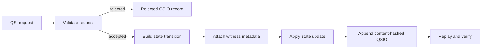

# qsio-kernel

`qsio-kernel` is a compact, executable reference implementation for bounded Quantum State Objects (QSOs) and Quantum State Interaction Objects (QSIOs). It provides an in-memory Python runtime for deterministic state transitions, content-addressed interaction records, witness metadata, lifecycle controls, ledger replay, and conformance-oriented fixtures.

Within A.L.I.S.T.A.I.R.E., this repository is presently a **candidate low-level semantic-kernel or reference-conformance component**. It can model bounded execution and produce reviewable evidence, but it does not own autonomous planning, device control, repository access, credentials, capability issuance, canonical state, merging, release, publication, deployment, or portfolio governance.

## Project status

The repository is an **experimental reference implementation**, not a production agent platform, autonomous network, device-management service, or control plane. Version `0.1.0` demonstrates deterministic local behavior with no external I/O, subprocess execution, network access, durable storage, or uncontrolled object spawning.

The current implementation:

- creates QSOs through an authorized local genesis interaction;
- records proposed and accepted state transitions in QSIO envelopes;
- hashes QSO states, transitions, witnesses, and ledger records;
- rejects transition payloads requesting forbidden external capabilities;
- supports Quietus and explicit resumption;
- replays the in-memory ledger to reproduce final QSO state hashes; and
- includes a four-QSO demonstration: Explorer, Archivist, Skeptic, and Synthesist.

It does **not** currently provide durable storage, distributed consensus, cryptographic signatures, independent witnesses, external model access, network federation, concurrent execution, comprehensive authorization enforcement, or production operations.

## Quick start

Requires Python 3.12 or later.

```bash
python -m venv .venv
source .venv/bin/activate
python -m pip install -e '.[test]'
pytest
python -m qsio.demo
```

The demo creates four bounded QSOs, executes a deterministic interaction chain, verifies the resulting QSIO records, replays final state, and places every QSO into Quietus.

## Conceptual model



- **QSO** — an identified object with a genome version, canon, state, permission metadata, and creation time.
- **QSI** — a requested interaction describing initiator, participants, referenced inputs, requested transition, and logical time.
- **QSIO** — the auditable local outcome containing pre-state hashes, transitions, witness metadata, outcome, reason codes, parent hashes, and a content hash.
- **Quietus** — a local lifecycle state that blocks ordinary mutation until an explicit resume operation.

## A.L.I.S.T.A.I.R.E. working boundary

The current portfolio model places Repository `0` upstream as proposal and orchestration support, Repository `1` or an approved successor as capability and canonical-disposition authority, QSO-GENOMES as declarative identity and policy authority, QSO-FABRIC as coordination and experiment evidence, and QSO-STUDIO/AionUi as review surfaces.

Under that model, `qsio-kernel` may execute only a bounded task already admitted by an external authority. A local canon value, `PermissionSet`, witness record, successful transition, or QSIO hash cannot grant permission to use a device, network, repository, credential, payment method, release channel, or deployment environment.

The unresolved architectural choice is whether this repository becomes:

1. the canonical low-level semantic kernel;
2. a small reference conformance implementation for QuantumStateObjects or another runtime;
3. a migration source whose accepted concepts move elsewhere; or
4. an independent research prototype.

The lowest-overlap candidate is a conformance implementation, but that remains a recommendation rather than an approved decision.

See [A.L.I.S.T.A.I.R.E. integration](docs/alistaire-integration.md), [obstruction and gluing analysis](docs/obstruction-and-gluing.md), and [ADR 0002](docs/adr/0002-alistaire-kernel-role.md).

## Material integration obstructions

The portfolio must still resolve:

- canonical QSO/QSI/QSIO schema, package, format, and compatibility ownership;
- overlap with QuantumStateObjects and QSO-FABRIC;
- genome validity versus operational admission;
- local `PermissionSet` metadata versus Repository `1` capabilities;
- local witness metadata versus independent attestation;
- in-memory ledger state versus canonical portfolio disposition;
- logical time versus observation time, freshness, expiry, and replay domains;
- evidence-reference, reason-code, correction, privacy, retention, and redaction contracts;
- Quietus versus freeze, revocation, emergency stop, and recovery; and
- release, migration, incident, rollback, publication, and withdrawal authority.

No adapter should be added until machine-readable pairwise and triple-overlap fixtures prove these contracts glue consistently.

## Documentation

- [Project site](docs/index.md)
- [Architecture](docs/architecture.md)
- [A.L.I.S.T.A.I.R.E. integration](docs/alistaire-integration.md)
- [Obstruction and gluing analysis](docs/obstruction-and-gluing.md)
- [Design and invariants](docs/design.md)
- [Public API](docs/api.md)
- [Developer onboarding](docs/onboarding.md)
- [Operations and recovery](docs/operations.md)
- [Security and trust boundaries](docs/security.md)
- [Task chain](taskchain.md)
- [Release and integration punch list](punchlist.md)
- [Release gates](release.md)
- [Changelog](changelog.md)

A Pages-ready MkDocs configuration is included in `mkdocs.yml`. Pull requests that change documentation are validated by an exact-head strict site build and produce a retained rendered-site evidence artifact. Publishing the site remains a repository-administration decision and is not performed by the documentation workflow.

## Scope discipline

Documentation in this repository describes behavior supported by repository evidence or clearly labels future work. New persistence, signatures, networking, autonomous spawning, external execution, federation, production authority, cross-repository orchestration, or canonical-state ownership requires an approved task-chain change, architecture decision, implementation evidence, security review, and rollback plan.

## License

MIT. See [LICENSE](LICENSE).
