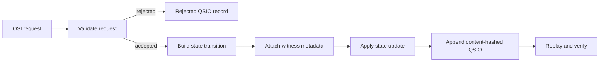

# qsio-kernel

`qsio-kernel` is the first executable, bounded semantic kernel for Quantum State Objects (QSOs) and Quantum State Interaction Objects (QSIOs). It provides an in-memory Python reference runtime for deterministic state transitions, content-addressed interaction records, witness metadata, ledger replay, and the Quietus lifecycle control.

## Project status

The repository is an **experimental reference implementation**, not a production agent platform or autonomous network. Version `0.1.0` demonstrates a deterministic local runtime with no external I/O, subprocess execution, network access, or uncontrolled object spawning.

The current implementation:

- creates QSOs through an authorized genesis interaction;
- records proposed and accepted state transitions in QSIO envelopes;
- hashes QSO states, transitions, witnesses, and ledger records;
- rejects transition payloads requesting forbidden external capabilities;
- supports Quietus and explicit resumption;
- replays the in-memory ledger to reproduce final QSO state hashes; and
- includes a four-QSO demonstration: Explorer, Archivist, Skeptic, and Synthesist.

It does **not** currently provide durable storage, distributed consensus, cryptographic signatures, external model access, network federation, concurrent execution, or production authorization policy.

## Quick start

Requires Python 3.12 or later.

```bash
python -m venv .venv
source .venv/bin/activate
python -m pip install -e '.[test]'
pytest
python -m qsio.demo
```

The demo creates four bounded QSOs, executes a deterministic interaction chain, verifies the resulting QSIO records, replays final state, and places every QSO into Quietus.

## Conceptual model



- **QSO** — an identified object with a genome version, canon, state, permissions, and creation time.
- **QSI** — a requested interaction describing an initiator, participants, referenced inputs, requested transition, and logical time.
- **QSIO** — the auditable result envelope containing pre-state hashes, transitions, witnesses, outcome, reason codes, parent hashes, and a content hash.
- **Quietus** — a lifecycle state that blocks ordinary mutation until an explicit resume operation.

## Documentation

- [Project site](docs/index.md)
- [Architecture](docs/architecture.md)
- [Design and invariants](docs/design.md)
- [API guide](docs/api.md)
- [Developer onboarding](docs/onboarding.md)
- [Security and trust boundaries](docs/security.md)
- [Task chain](taskchain.md)
- [Release gates](release.md)
- [Changelog](changelog.md)

A Pages-ready MkDocs configuration is included in `mkdocs.yml`. Publishing the site is a repository administration decision and is not performed by this documentation change.

## Scope discipline

Documentation in this repository describes behavior that exists in the current code or clearly labels future work. New persistence, networking, autonomous spawning, external execution, federation, or authority mechanisms require an approved task-chain change and corresponding verification evidence.

## License

MIT. See [LICENSE](LICENSE).
