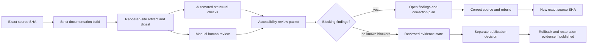

# Accessibility review and exact-head evidence

Status: `ACCESSIBILITY_REVIEW_PROTOCOL_DOCUMENTED_SITE_NOT_CERTIFIED`

This guide defines how the rendered `qsio-kernel` documentation candidate should be reviewed for accessibility and how that review should be bound to one immutable source generation. It does **not** certify the current site, authorize GitHub Pages publication, appoint an accessibility reviewer, or claim compliance with a legal or technical standard.

The protocol applies to the rendered technical documentation only. It does not evaluate the accessibility of a future runtime, command-line tool, desktop application, remote interface, device integration, or any other product surface.

## Why exact-head review matters

Documentation accessibility can change when a heading moves, a table gains a column, a diagram loses its prose equivalent, a theme changes, or navigation is reordered. A review that is not bound to the exact source, rendered artifact, environment, and findings cannot establish the state of a later generation.

Every review packet therefore binds:

- repository and exact source commit;
- workflow run and rendered-site artifact;
- artifact digest and file manifest;
- MkDocs and Python versions;
- browser, operating system, viewport, zoom, and assistive-technology context;
- reviewer identity or an explicit vacancy;
- automated results, manual observations, unresolved limitations, and residual risk;
- correction, supersession, withdrawal, and rollback references.

A source change makes the prior accessibility result historical. It may remain useful evidence, but it must not be represented as current.

## Review states

| State | Meaning | Authority effect |
| --- | --- | --- |
| `NOT_REVIEWED` | No complete exact-head review packet exists. | None |
| `AUTOMATED_CHECKS_ONLY` | Machine checks ran, but required human review is absent. | None |
| `MANUAL_REVIEW_INCOMPLETE` | Some manual checks were recorded, with required checks or environments missing. | None |
| `REVIEWED_WITH_OPEN_FINDINGS` | The exact artifact was reviewed and unresolved findings remain. | None; publication remains blocked unless an authorized decision accepts the risk |
| `REVIEWED_NO_KNOWN_BLOCKERS` | The required protocol completed without a known blocking finding. | Evidence only; not certification or publication approval |
| `SUPERSEDED` | A later source or artifact replaced the reviewed generation. | Historical evidence only |
| `WITHDRAWN` | The review result was withdrawn because its source, method, artifact, or interpretation was defective. | No current reliance |
| `UNKNOWN` | Review state cannot be established from available evidence. | Fail closed |

The safe default is `NOT_REVIEWED` or `UNKNOWN`, never inferred conformance.

## Evidence flow



### Prose equivalent

An immutable source commit is built into a rendered-site artifact with recorded digests. Automated structural checks and manual human review examine the same artifact. Their results form one accessibility review packet. Blocking findings lead to a correction plan and a new source generation rather than an edited historical result. A packet with no known blockers remains review evidence only; publication is a separate authorized decision. If a site is later published, rollback and independently verified restoration require additional evidence.

## Automated checks

Automated checks are useful for repeatability, but they cannot establish complete accessibility. The documentation workflow should verify at least:

1. every required page is present and reachable from navigation;
2. local links and anchors resolve;
3. headings do not skip levels within a page without an explained structural reason;
4. every Mermaid diagram has a nearby prose equivalent;
5. tables include a header row and do not use blank headers to convey structure;
6. images, if introduced, have meaningful alternatives or are explicitly decorative;
7. link text is understandable without relying only on surrounding context;
8. generated pages do not contain secrets or authority-expanding publication claims;
9. the review profile is valid JSON with duplicate keys and non-finite values rejected; and
10. the source tree remains unchanged by validation.

Passing these checks means only that the tested structural invariants were satisfied.

## Manual review matrix

The following checks require a human reviewer using the exact rendered artifact.

### Keyboard and focus

- Reach every navigation, content, and interactive element using a keyboard alone.
- Confirm focus is visible and follows reading order.
- Confirm no keyboard trap is introduced by navigation, code blocks, tables, or browser controls.
- Confirm the skip-navigation path, if supplied by the theme, reaches the main content.

### Headings and landmarks

- Confirm each page has one clear primary heading.
- Confirm heading levels represent the document hierarchy rather than visual styling.
- Confirm navigation, main content, and footer landmarks are announced coherently.
- Confirm repeated site furniture does not obscure the page title or current location.

### Screen-reader reading order

- Review the landing page, architecture page, API page, lifecycle page, crosswalk page, obstruction page, and this page with at least one screen reader.
- Confirm tables announce meaningful headers and remain understandable row by row.
- Confirm inline code, code blocks, hashes, identifiers, and status labels are distinguishable.
- Confirm Mermaid content is not the only source of any requirement, transition, or warning.

### Zoom, reflow, and low-bandwidth use

- Review at 200% and 400% zoom without loss of content or required horizontal page scrolling.
- Confirm long hashes, code, and tables wrap or remain operable without hiding adjacent content.
- Confirm the prose remains complete when diagrams fail to render.
- Confirm the site remains understandable with styles or scripts unavailable.

### Contrast and non-color meaning

- Confirm text and focus indicators remain distinguishable against their backgrounds.
- Confirm status, risk, lifecycle, and mapping dispositions are never conveyed by color alone.
- Confirm code, links, headings, and table boundaries remain identifiable in high-contrast or forced-color modes where available.

### Cognitive access and technical clarity

- Confirm acronyms are expanded or linked at first substantive use.
- Confirm status labels and denial boundaries are stated in plain language near consequential claims.
- Confirm long procedures are divided into ordered steps with explicit stopping conditions.
- Confirm similarly named concepts such as QSI, QSIO, runtime admission, conformance, execution, receipt, and canonical disposition remain distinguishable.
- Confirm uncertainty, unsupported routes, and unresolved ownership are not hidden in footnotes or diagrams.

### Motion, media, and timing

The current documentation is static and introduces no required animation, audio, video, timed response, or auto-refresh. A future change that adds any of those features must add pause, stop, transcript, caption, timing, and reduced-motion requirements before publication.

## Diagram and table integrity

Every architecture or lifecycle diagram must have a prose equivalent that:

- names the same components and transitions;
- preserves direction and failure branches;
- states non-authority boundaries represented visually;
- does not omit `UNKNOWN`, `UNSUPPORTED`, partial, rejected, corrected, revoked, or recovery states; and
- is updated in the same change as the diagram.

A table must not be the sole representation of a critical process when narrow-screen or screen-reader use would make the relationship difficult to recover. Critical tables should be preceded or followed by a concise prose interpretation.

## Required review packet

A complete packet records:

```text
Repository:
Exact source SHA:
Pull request or reviewed branch:
Workflow run:
Rendered artifact ID and name:
Artifact digest:
Site-file manifest digest:
Python and MkDocs versions:
Review date:
Reviewer or vacancy:
Browsers and operating systems:
Viewport and zoom conditions:
Screen reader and version:
Keyboard review result:
Heading and landmark review result:
Table review result:
Diagram/prose equivalence result:
Contrast and forced-color result:
Reflow and low-bandwidth result:
Cognitive-access result:
Automated structural-check result:
Open findings and severity:
Known untested conditions:
Residual risk:
Correction or supersession record:
Publication decision reference, if any:
Previous known-good site artifact, if any:
Rollback and restored-state evidence, if any:
```

Missing required evidence must remain visible as a vacancy or `UNKNOWN`; it must not be silently omitted.

## Finding severity and disposition

| Severity | Example | Required disposition |
| --- | --- | --- |
| Blocking | Keyboard trap, inaccessible navigation, diagram-only requirement, hidden critical warning | Correct and rebuild before publication consideration |
| High | Major reading-order failure, unusable table, missing focus visibility | Correct before publication unless an authorized, documented risk decision applies |
| Moderate | Local heading defect, ambiguous link text, poor narrow-screen wrapping | Correct in the bounded documentation branch and supersede the reviewed packet |
| Low | Non-blocking wording or consistency issue | Track with an owner or vacancy and target generation |
| Unknown | Environment or assistive technology not reviewed | Preserve as an explicit evidence gap |

A finding is closed only by a new exact-head artifact and a review that demonstrates the correction. Editing the prior packet does not prove repair.

## Publication, withdrawal, and rollback boundary

A `REVIEWED_NO_KNOWN_BLOCKERS` result does not authorize Pages publication. Publication additionally requires a named approver, deployment source, privacy and licensing review, public-artifact retention policy, previous known-good artifact, withdrawal route, and rollback owner.

If a published site is found to contain a blocking accessibility defect:

1. preserve the affected source, artifact, finding, and report;
2. withdraw or clearly mark the affected public claim when necessary;
3. correct the documentation on a new branch;
4. rebuild from an immutable source;
5. repeat the relevant manual and automated review;
6. deploy only through an authorized publication path; and
7. independently verify the restored public state rather than relying solely on the deployment actor.

Rollback must not restore stale architecture claims, withdrawn compatibility claims, revoked authority, sensitive content, or a site generation with the same unresolved defect.

## Reviewer onboarding

A reviewer should begin with:

1. [Project overview](index.md);
2. [Architecture](architecture.md);
3. [Public API](api.md);
4. [Kernel-to-runtime crosswalk options](kernel-to-runtime-crosswalk-options.md);
5. [Obstruction and gluing analysis](obstruction-and-gluing.md);
6. [Security and trust boundaries](security.md); and
7. this protocol and its [machine-readable profile](accessibility-review-profile-v1.json).

Stop the review and record a blocking finding when the artifact does not match the submitted source, a required page is absent, the prose and diagram disagree, critical content is inaccessible without a pointer device or visual interpretation, or the review is asked to imply certification or publication authority it does not possess.

## FYSA-120 capability mapping

This protocol applies:

- `011-B` and `011-E` for accessible visual communication and diagram–prose integrity;
- `012-A`, `012-B`, `012-D`, and `012-E` for information architecture, technical exposition, documentation testing, and lifecycle synchronization;
- `018-B`, `018-D`, and `018-E` for review-record organization, onboarding continuity, and contested-history preservation;
- `019-B`, `019-C`, and `019-D` for plain-language status, accessibility, and risk communication;
- `031-A`, `031-D`, and `031-E` for review invariants, hostile validation, and regression prevention; and
- `040-E` for rollback, restoration, and continuity evidence.

Proposed non-authoritative refinement:

**`019-R — Exact-generation technical-site accessibility evidence, non-certification boundaries, and independently verified restoration`**

The refinement is a skill-tree proposal only. It does not create an accessibility standard, legal conclusion, certification authority, publication authority, or reviewer appointment.
