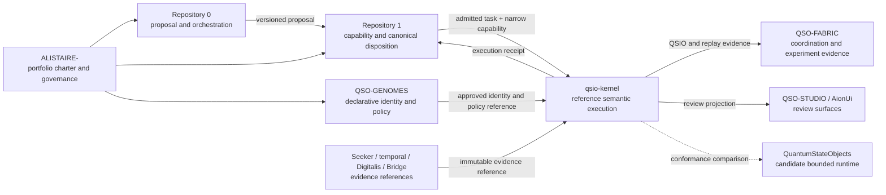

# A.L.I.S.T.A.I.R.E. integration

## Portfolio role

`qsio-kernel` is a candidate low-level semantic component within A.L.I.S.T.A.I.R.E. Its present contribution is narrow and testable: it converts bounded interaction requests into deterministic local state transitions and content-addressed QSIO evidence inside one Python process.

The current portfolio model assigns:

- Repository `0` to portable bootstrap, observation, proposal preparation, and bounded orchestration;
- Repository `1` or an approved successor to capability admission, revocation, canonical disposition, and recovery state;
- QSO-GENOMES to declarative identity, lineage, and policy references;
- QuantumStateObjects to the candidate bounded runtime role;
- QSO-FABRIC to multi-QSO coordination and experiment evidence;
- QSO-SEEKER, temporal interpretation, QSO-DIGITALIS, and Bridge to evidence acquisition, interpretation, and transport boundaries; and
- QSO-STUDIO and AionUi to human review and presentation.

`qsio-kernel` does not own any of those portfolio-wide authorities merely because it can represent related fields. It remains an experimental semantic implementation until its durable role is approved.

## What the kernel contributes

The implementation provides four useful primitives:

1. **Bounded state** — a QSO has explicit identity, genome version, canon, permission metadata, lifecycle, logical clock, and content-hashed state.
2. **Explicit intent** — a QSI identifies initiator, participants, referenced evidence, requested transition, and logical time.
3. **Auditable local outcome** — a QSIO records pre-state hashes, proposed and accepted transitions, witness metadata, outcome, reason codes, parent records, and a content hash.
4. **Deterministic local reconstruction** — the in-memory ledger can be replayed to reconstruct a selected QSO state and compare its hash with the runtime result.

These primitives make proposed cognitive or autonomous behavior inspectable before connection to external tools or consequential authority. They do not provide durable consensus, independent attestation, or authorization on their own.

## Candidate system position

This is an integration candidate, not a deployed topology. The unresolved relationship between `qsio-kernel` and QuantumStateObjects is release significant.

## Repository `0` and Repository `1` route

The working cross-repository route is:

`0:working → 0:proposal (local, non-authoritative) → versioned envelope → 1:quarantine`

The kernel is not part of proposal admission. It may execute only after Repository `1` or another approved authority has:

1. admitted a task;
2. resolved accepted contract and genome versions;
3. issued a narrow, expiring capability;
4. bound the capability to the intended actor, environment, runtime, inputs, limits, and expected pre-state; and
5. declared receipt, revocation, incident, and rollback requirements.

A local `PermissionSet`, canon value, witness record, successful transition, or QSIO hash cannot replace that admission.

## Input contract

A future portfolio adapter should provide only inputs already authorized and normalized by external policy boundaries.

| Input | Current kernel representation | Required portfolio contract |
| --- | --- | --- |
| Runtime identity | process/package context | immutable runtime and implementation identity |
| QSO identity | `qso_id` | issuer, uniqueness domain, ownership scope, retirement and replacement |
| Genome reference | `genome_version` | resolver, digest, lineage, compatibility, revocation and admission |
| Canon constraints | tuple of strings | declarative schema, projection and local enforcement semantics |
| Interaction intent | `QSI` | admitted task identity, capability, expected pre-state and replay domain |
| Evidence references | `input_refs` | subject, integrity, provenance, time, privacy, correction, revocation and license |
| Capability policy | `PermissionSet` metadata | external issuer, narrowing adapter, expiry, revocation and enforcement boundary |
| Logical time | integer | clock domain, causal ordering and relationship to wall-time evidence |
| Resource limits | not comprehensive | time, memory, transition count, input size and failure behavior |

The current code accepts in-process Python values. It does not resolve remote schemas, authenticate callers, verify external signatures, retrieve evidence, or contact Repository `1`.

## Output contract

For an accepted or rejected interaction, the kernel produces a QSIO containing:

- the original QSI;
- participant pre-state hashes;
- proposed and accepted transitions;
- witness metadata;
- explicit local outcome and reason codes;
- parent QSIO hashes;
- a deterministic logical timestamp supplied by the runtime clock; and
- a domain-separated content hash.

Consumers must preserve five separate states of meaning:

1. **local execution outcome** — what this semantic path accepted or rejected;
2. **evidence verification outcome** — whether the record and referenced artifacts verify under a declared profile;
3. **policy evaluation** — whether current policy accepts the result;
4. **canonical disposition** — whether Repository `1` or another authority records it as accepted state; and
5. **later correction or revocation** — whether current authorization or presentation has changed.

A successful local QSIO is not automatic permission to modify a repository, operate a device, execute a payment, publish a release, or deploy a service.

## Boundary with QuantumStateObjects

The portfolio currently has two executable semantic candidates. The acceptable durable choices are:

- `qsio-kernel` becomes the canonical low-level semantic kernel;
- QuantumStateObjects owns the canonical runtime and `qsio-kernel` becomes a reference conformance implementation;
- accepted kernel concepts and fixtures migrate into QuantumStateObjects and this repository becomes preserved provenance; or
- both remain independent research systems with no shared canonical claim.

The lowest-overlap candidate is a small reference conformance implementation, because it preserves the kernel’s deterministic fixture value without duplicating broad runtime ownership. This is a recommendation for review, not an approved decision.

Conformance would require machine-readable fixtures proving equivalent or explicitly mapped:

- identity and genome references;
- accepted and rejected outcomes;
- canonical serialization or declared representation mapping;
- transition and reason-code semantics;
- lifecycle and Quietus mapping;
- parent and replay behavior; and
- correction, revocation, and unsupported-version behavior.

## Boundary with QSO-GENOMES

QSO-GENOMES may define declarative identity, lineage, compatibility, and policy data. The kernel may consume an admitted projection, but it must not:

- become the genome registry;
- infer operational authority from declarative validity;
- rewrite genome history;
- silently downgrade policy; or
- grant a capability because a genome contains a role or permission label.

Genome → kernel → Fabric triple-overlap fixtures are required before portfolio integration.

## Boundary with QSO-FABRIC

QSO-FABRIC may coordinate experiments and aggregate evidence, but it must not silently redefine:

- QSO/QSI/QSIO canonical fields;
- transition hashing;
- lifecycle and Quietus behavior;
- local reason-code meaning;
- Repository `1` canonical disposition; or
- correction and revocation status.

The runtime-to-Fabric contract must decide whether Fabric receives complete QSIO records, bounded projections, replay checkpoints, contradiction annotations, or experiment-local events.

## Boundary with evidence repositories

`input_refs` are opaque in the current kernel. A portfolio evidence-reference profile should preserve:

- subject and source identity;
- content integrity and canonical locator;
- acquisition and transformation provenance;
- observation and assessment time domains;
- freshness, replay, correction, and revocation state;
- privacy classification and retention;
- license and attribution obligations; and
- interpretation profile identity.

The kernel should consume references and declared interpretations, not silently retrieve, sanitize, temporally assess, or reinterpret source material.

## Boundary with Bridge and review surfaces

Bridge may transport approved profiles, while QSO-STUDIO and AionUi may present them. Those layers must preserve:

- exact source, runtime, schema, and record identity;
- proposed versus accepted transitions;
- local versus canonical disposition;
- reason codes and `UNKNOWN` or partial states;
- witness-strength limitations;
- freshness, correction, supersession, and revocation; and
- the difference between annotation, recommendation, authenticated approval, and canonical acceptance.

Transport success and interface interaction do not create authority.

## Lifecycle and emergency control

Quietus is a local semantic lifecycle control. It is not equivalent to external capability revocation, portfolio freeze, quarantine, device isolation, or production emergency stop.

A future lifecycle crosswalk must prove:

- local Quietus blocks ordinary transitions;
- Repository `1` revocation prevents new admissions;
- queued and in-flight work reach a declared state;
- evidence and volatile state are preserved;
- there is no automatic unlock;
- correction and revocation propagate to consumers; and
- recovery resumes from an approved checkpoint with old capabilities invalid.

## Repository boundaries

### Owned here today

- Python records for QSO, QSO state, QSI, QSIO, transitions, witnesses, and related semantics.
- Deterministic canonical serialization and domain-separated hashing.
- In-memory runtime context, ledger, state history, and replay.
- Genesis, ordinary transition, Quietus, and resume prototype flows.
- Local demo and tests.

### Not owned here today

- Portfolio objectives, task planning, or proposal admission.
- Genome registry or canonical genome governance.
- Capability issuance, expiry, revocation, credentials, or key custody.
- Cross-repository canonical state.
- Evidence acquisition, temporal authority, domain interpretation, or transport.
- GitHub actions, branch creation, pull requests, merge, release, publication, or deployment.
- External model, browser, filesystem, subprocess, network, payment, or device-control access.
- Durable evidence storage, independent attestation, distributed consensus, or production identity.
- Continuous autonomous operation, self-directed spawning, or self-modification.

## Integration acceptance gates

Before this repository is used as a canonical or conformance A.L.I.S.T.A.I.R.E. component:

- [ ] Durable repository role and package identity are approved.
- [ ] QSO/QSI/QSIO and format ownership are assigned.
- [ ] Overlap with QuantumStateObjects and QSO-FABRIC is resolved.
- [ ] Genome, evidence-reference, capability, reason-code, lifecycle, correction, and persistence profiles are versioned.
- [ ] Repository `0` → Repository `1` → kernel admission fixtures pass.
- [ ] Genome → kernel → Fabric fixtures pass.
- [ ] Seeker → temporal interpretation → kernel fixtures pass.
- [ ] Kernel → Fabric → Repository `1` fixtures pass.
- [ ] Kernel → Bridge → review-interface fixtures pass.
- [ ] Quietus → revocation → recovery fixtures pass.
- [ ] Determinism is verified across supported environments.
- [ ] Privacy, retention, correction, emergency-stop, incident, recovery, and rollback owners are assigned.
- [ ] Human approval requirements for consequential external actions are explicit.

See [Obstruction and gluing analysis](obstruction-and-gluing.md) and the root [`punchlist.md`](https://github.com/aevespers2/qsio-kernel/blob/main/punchlist.md).

## Architectural clarification required

The portfolio must decide whether `qsio-kernel` is:

1. the canonical low-level semantic kernel;
2. a reference conformance implementation for QuantumStateObjects or another canonical runtime;
3. a migration source whose accepted concepts and tests move elsewhere; or
4. an independently maintained research prototype.

That decision must also assign schema, format, identity, capability, evidence, lifecycle, correction, privacy, persistence, release, incident, emergency-stop, recovery, and rollback ownership. Until then, this repository remains a bounded local reference implementation and documentation candidate.
