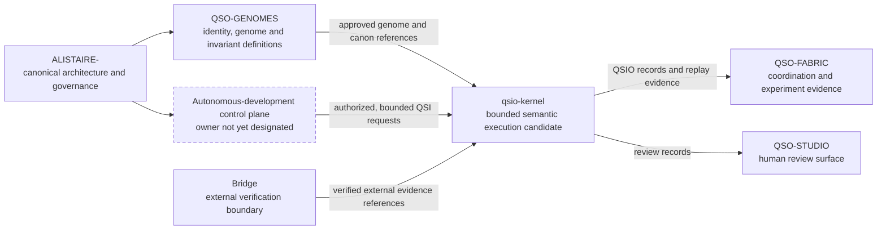
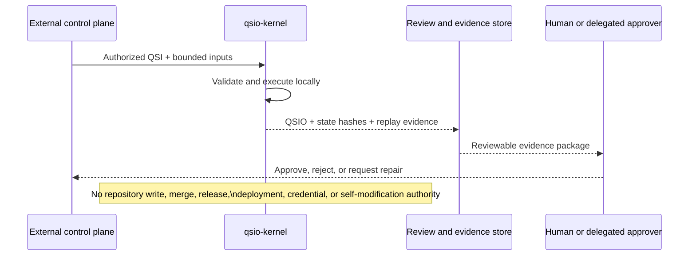

# A.L.I.S.T.A.I.R.E. integration

## Portfolio role

`qsio-kernel` is a candidate semantic-kernel component within the A.L.I.S.T.A.I.R.E. ecosystem. Its present contribution is narrow and testable: it converts bounded interaction requests into deterministic state transitions and content-addressed evidence records inside one local Python process.

The repository does not currently own A.L.I.S.T.A.I.R.E. orchestration, learning policy, repository automation, credentials, deployment, release authority, or cross-system governance. Those responsibilities must remain outside this kernel unless a later architecture decision explicitly assigns and constrains them.

## What the kernel contributes

The current implementation provides four useful primitives for the larger system:

1. **Bounded state** — a QSO has an explicit identity, genome version, canon, permission record, lifecycle, logical clock, and content-hashed state.
2. **Explicit intent** — a QSI describes who initiated an interaction, who participates, which evidence is referenced, and which transition is requested.
3. **Auditable outcome** — a QSIO records pre-state hashes, proposed and accepted transitions, witness metadata, outcome, reason codes, parent records, and its own content hash.
4. **Deterministic reconstruction** — the in-memory ledger can be replayed to reproduce a selected QSO state and compare the reconstructed hash with the runtime result.

These primitives are valuable because they make proposed cognitive or autonomous behavior inspectable before it is connected to external tools or granted consequential authority.

## Position in the system

This diagram describes an integration candidate, not a deployed topology. The canonical owner of the runtime contract and the autonomous-development control plane remains an architectural decision.

## Input contract

A future portfolio integration should supply the kernel only with inputs that are already authorized by an external policy boundary:

| Input | Current representation | Required portfolio decision |
| --- | --- | --- |
| QSO identity | `qso_id` | canonical issuer and uniqueness domain |
| Genome reference | `genome_version` | owner, resolution rules, compatibility policy |
| Canon constraints | tuple of strings | canonical schema and enforcement semantics |
| Interaction intent | `QSI` | authorization source and validation profile |
| Evidence references | `input_refs` | URI format, integrity, classification, retention |
| Capability policy | `PermissionSet` | issuer, revocation, expiry, enforcement boundary |
| Logical time | integer | ordering scope and cross-runtime reconciliation |

The current code accepts in-process Python values. It does not resolve remote schemas, authenticate callers, verify signatures, or retrieve referenced evidence.

## Output contract

For an accepted or rejected interaction, the kernel produces a QSIO record containing:

- the original QSI;
- participant pre-state hashes;
- proposed and accepted transitions;
- witness metadata;
- an explicit outcome and reason codes;
- parent QSIO hashes;
- a deterministic timestamp supplied by the runtime clock; and
- a domain-separated content hash.

Portfolio consumers must not interpret these fields more strongly than the implementation supports. In particular, a witness record is not an independent signature, a permission record is not a complete authorization system, and an in-memory parent-hash chain is not durable consensus.

## Autonomous-development relationship

A.L.I.S.T.A.I.R.E.'s long-term autonomous-development loop can use this kernel as an evidence-producing execution substrate only after an external control plane has done the consequential work of:

1. selecting an objective;
2. assigning a bounded task and capability set;
3. resolving approved genome and canon versions;
4. providing immutable input and evidence references;
5. reviewing the resulting QSIO and test evidence;
6. authorizing repository, release, or deployment actions; and
7. retaining emergency-stop and rollback authority.

The kernel may describe a transition; it does not grant itself permission to perform external actions.

## Repository boundaries

### Owned here today

- Python data structures for QSO, QSI, QSIO, transitions, witnesses, and related semantic records.
- Deterministic canonical serialization and hashing.
- In-memory runtime context, ledger, state history, and replay.
- Genesis, ordinary transition, Quietus, and resume prototype flows.
- Local demo and tests.

### Not owned here today

- A.L.I.S.T.A.I.R.E. mission prioritization or task planning.
- Genome registry or canonical genome governance.
- Cross-repository orchestration.
- GitHub credentials, branch creation, pull-request preparation, review, merge, or release.
- External model, browser, filesystem, subprocess, network, payment, or deployment access.
- Durable evidence storage, independent attestation, distributed consensus, or production identity.
- Continuous operation, self-directed spawning, or self-modification.

## Integration acceptance gates

Before this repository is used as a canonical A.L.I.S.T.A.I.R.E. runtime component, the portfolio should record evidence for all of the following:

- [ ] Canonical runtime owner and package identity are approved.
- [ ] Overlap with `QuantumStateObjects` and `QSO-FABRIC` is resolved.
- [ ] Public schemas and compatibility rules are versioned.
- [ ] Genome, canon, evidence-reference, and capability issuers are designated.
- [ ] Independent authorization and revocation semantics are defined.
- [ ] Durable ledger, corruption recovery, retention, and migration policies are approved.
- [ ] Determinism is verified across supported environments.
- [ ] Witness identity and verification strength are defined.
- [ ] Emergency stop, rollback, incident response, and audit ownership are assigned.
- [ ] Human or delegated approval requirements for consequential actions are explicit.

Until these gates are satisfied, `qsio-kernel` remains an experimental local reference implementation and integration candidate.

## Architectural clarification required

The portfolio must decide whether `qsio-kernel` is:

1. the canonical low-level semantic kernel used by A.L.I.S.T.A.I.R.E.;
2. an experimental precursor whose accepted concepts migrate into `QuantumStateObjects`;
3. a conformance and test-fixture implementation for another canonical runtime; or
4. a separately maintained research prototype.

That decision determines contract ownership, versioning, duplication policy, release responsibility, and the correct direction of future documentation and implementation work.