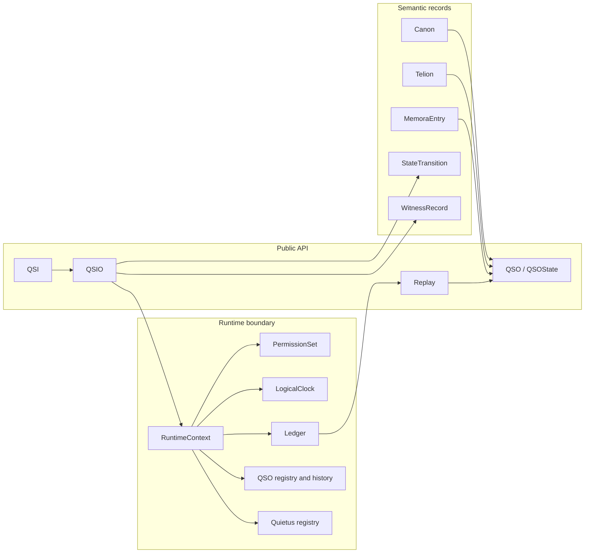
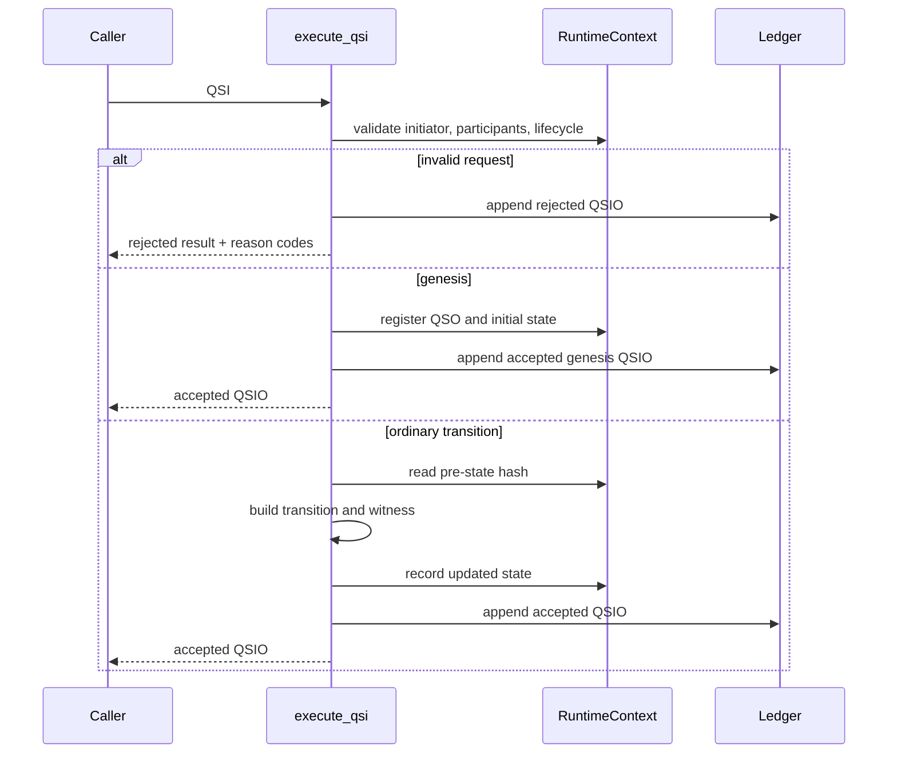
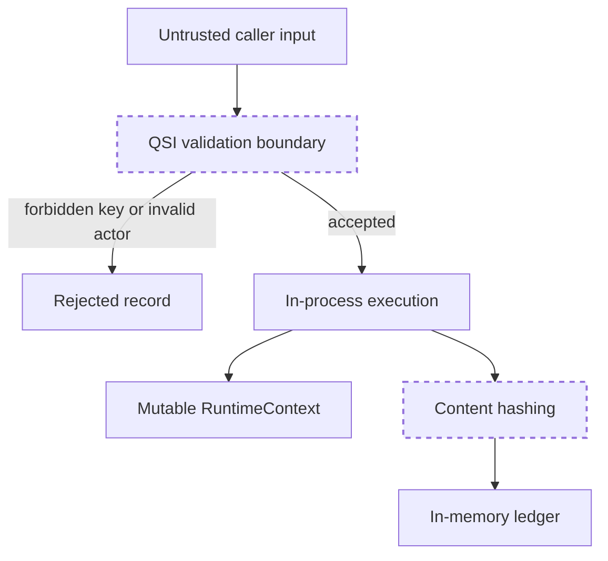

# Architecture

## Architectural intent

`qsio-kernel` is a single-process semantic reference runtime. Its architecture favors deterministic behavior, explicit records, and replayable state over throughput, distribution, or external integration.

## Component map

## Runtime flow

## Major responsibilities

### QSO and state

A `QSO` binds identity and configuration to its current `QSOState`. The state includes lifecycle, visible `lumen` data, an optional `umbra_commitment`, references to Telion and Memora roots, logical time, and a content hash.

### QSI

A `QSI` is an immutable request. It does not itself mutate state. It identifies the interaction type, initiator, participants, input references, requested transition, and logical time.

### QSIO

A `QSIO` is the result envelope. It records the request, pre-state hashes, proposed and accepted transitions, witness records, outcome, reason codes, parent hashes, creation time, and its own content hash.

### RuntimeContext (Sanctum)

`RuntimeContext` is the current execution boundary. It owns the logical clock, limits, permission set, ledger, QSO registry, state history, Quietus registry, and genesis authorization flag. All of these structures are currently in memory.

### Replay

Replay consumes ledger records through an optional QSIO boundary and reconstructs state for a selected QSO. The demo and tests compare the replayed final content hash with the runtime's current state hash.

## Trust boundaries

The current validation boundary is semantic rather than an operating-system sandbox. Rejecting keys such as `network`, `external_io`, `subprocess`, and `spawn` prevents those requests from being accepted by this kernel path, but it does not constitute process isolation.

## Deployment topology

There is currently one supported topology: a local Python process with an in-memory runtime. The package exposes a console entry point and module demo. No server, database, queue, remote API, browser client, or background service is part of version `0.1.0`.

## Architectural extension rule

Persistence, signatures, independent witness services, external models, concurrency, networking, federation, or autonomous object creation must be introduced as separate bounded changes with explicit schemas, migration behavior, threat analysis, and release evidence. They are not implied by the present abstractions.
