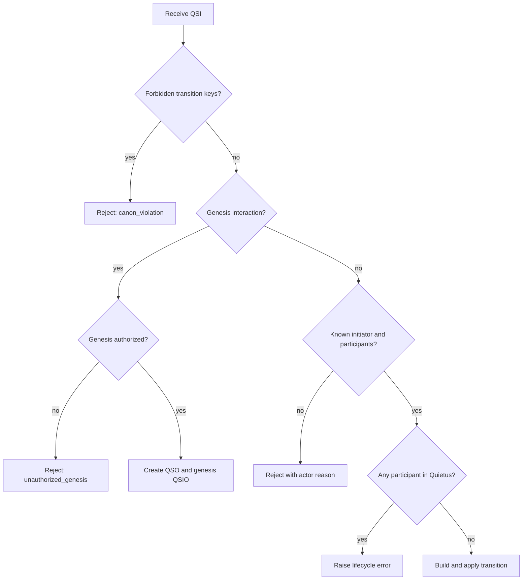
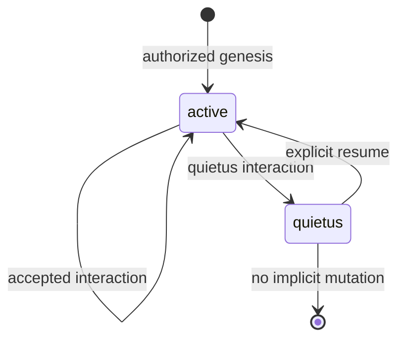

# Design and invariants

## Design goals

The kernel is designed to make a QSO interaction:

- explicit before execution;
- bounded by lifecycle and canon checks;
- linked to the state it intends to change;
- represented by a deterministic transition record;
- accompanied by witness metadata;
- content-addressed; and
- replayable from an ordered ledger.

## Domain objects

### QSO state

A QSO state contains:

| Field | Meaning |
| --- | --- |
| `state_version` | Monotonic state revision within the prototype |
| `lifecycle` | `genesis`, `active`, `quietus`, `quarantined`, or `retired` |
| `lumen` | Visible semantic state represented as JSON-compatible data |
| `umbra_commitment` | Optional commitment to non-visible material |
| `telion_hash` | Content reference to the purpose/goal structure |
| `memora_root` | Content reference to memory/provenance material |
| `logical_time` | Deterministic ordering value |
| `content_hash` | Domain-separated hash of the preceding fields |

### Interaction request

A QSI contains the request only. The kernel derives the resulting transition and QSIO envelope. Callers should treat QSI logical time and input references as provenance inputs, not as proof that an event occurred.

### Transition

A state transition names a target QSO, operation, precondition hash, patch, postcondition hash, confidence, evidence references, and its own content hash. The precondition hash protects against applying a transition to an unexpected state within the current execution path.

### Witness

A witness record identifies a verifier, verification flag, evidence references, observation time, and notes. In version `0.1.0`, witnesses are generated by the same in-process runtime. They are integrity metadata, not independent attestation or a cryptographic signature.

## Hashing model

The implementation uses domain-separated payload hashing. Conceptually:

```text
hash = SHA-256(domain || canonical_serialization(payload))
```

Separate domains are used for QSO state, transitions, witness records, QSIO records, and identifiers. This prevents identical serialized values from being treated as interchangeable across object types.

The content hash proves consistency with the canonicalized payload supplied to the hashing function. It does not prove authorship, external observation, timestamp accuracy, or durable retention.

## Validation sequence



Rejected validation results are still represented as QSIO records and appended to the ledger. Lifecycle exceptions currently follow a different code path and may raise before a rejected QSIO is produced; callers must not assume every failure is ledger-recorded.

## Lifecycle



The type model reserves `quarantined` and `retired`, but version `0.1.0` does not yet implement full transition workflows for those states.

## Replay invariant

For a QSO whose accepted history is fully represented in the ledger:

```text
replay(qso_id).content_hash == runtime.current_state(qso_id).content_hash
```

This invariant is covered by the demo and tests. Replay is currently scoped to the in-memory ledger and does not validate external persistence or cross-process reproducibility.

## Determinism

The demo uses a logical clock and deterministic timestamp strings. This is useful for repeatable examples, but those timestamps are not wall-clock observations. Any future real-time clock source must be injected explicitly and included in reproducibility and verification policy.

## Permission model

`PermissionSet` and capability records exist in the public model, and `RuntimeContext` can evaluate a resource/operation pair. The principal interaction execution path does not yet perform comprehensive capability checks. Documentation and downstream code must not describe the current permission model as production authorization enforcement.

## Compatibility

Versioned hash domains and genome identifiers are the current compatibility anchors. Before changing field meaning, canonical serialization, hash construction, lifecycle semantics, or transition patch behavior, add fixtures demonstrating old/new behavior and document whether the change is backward compatible, migratable, or intentionally breaking.
