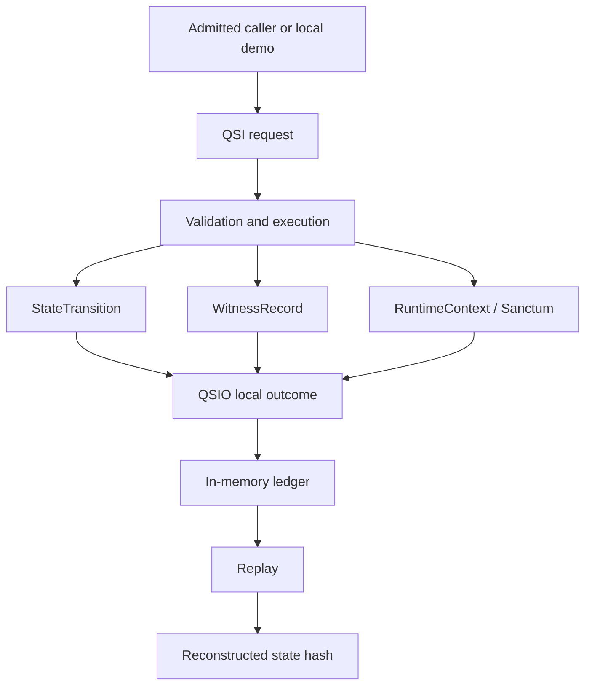

# QSIO Kernel

`qsio-kernel` is a compact Python reference implementation for representing bounded Quantum State Objects and recording their interactions as deterministic, content-addressed QSIO records.

It exists to make state, intent, transition evidence, lifecycle controls, and replay semantics executable and inspectable before those concepts are connected to persistence, external tools, distributed systems, device control, or consequential authority.

## Current status

| Attribute | Current posture |
| --- | --- |
| Version | `0.1.0` experimental reference implementation |
| Runtime | Single local Python 3.12 process |
| State | In memory |
| Interaction model | Explicit QSI requests producing QSIO result records |
| Integrity | Domain-separated content hashing |
| Lifecycle | Genesis, active operation, Quietus, explicit resume |
| Replay | Deterministic reconstruction from the in-memory ledger |
| Portfolio role | Candidate reference-conformance implementation; not approved |
| Kernel-to-runtime route | `DOCUMENTED_NOT_SELECTED`; safe default `UNSUPPORTED` |
| External authority | None |
| Production readiness | Not claimed |

## Why this repository exists

The kernel turns a small set of QSO concepts into testable contracts:

1. an interaction request is explicit;
2. the pre-state is identified by hash;
3. a transition is proposed and either accepted or rejected;
4. witness metadata and evidence references are attached;
5. the resulting record is content hashed and appended to a ledger; and
6. state can be reconstructed through replay.

The implementation deliberately optimizes for clarity, boundedness, and deterministic evidence rather than throughput, distribution, autonomy, or integration breadth.

## Current capabilities

| Capability | Current implementation |
| --- | --- |
| Genesis | Authorized in-process creation of a QSO |
| State mutation | Patch-based transitions over bounded state fields |
| Validation | Rejects unknown actors and forbidden external-operation keys |
| Evidence links | Opaque input references carried into transitions and witnesses |
| Integrity | Domain-separated SHA-256 content hashes |
| Ledger | Ordered in-memory QSIO records with parent references |
| Lifecycle control | Quietus blocks ordinary interaction; resume is explicit |
| Replay | Reconstructs QSO state from ledger history |
| Demonstration | Four role-bounded QSOs complete a deterministic chain |

## Explicit non-capabilities

The kernel does not currently provide:

- durable or replicated storage;
- signature-backed identity or independent witnesses;
- distributed agreement or concurrency safety;
- production authorization, credential management, or canonical state;
- network, browser, filesystem, subprocess, model, payment, repository, or device integration;
- autonomous learning, task planning, deployment, or self-directed spawning; or
- a complete A.L.I.S.T.A.I.R.E. control plane.

The validator's forbidden-operation keys are semantic controls inside this execution path, not an operating-system sandbox.

## Architecture at a glance

### Prose equivalent

A local caller or demo creates a QSI request. The kernel validates the request, reads the bounded runtime context, constructs a transition and witness metadata, emits a local QSIO outcome, appends it to an in-memory ledger, and later replays that ledger to reconstruct the state hash. None of these steps creates external authority.

## A.L.I.S.T.A.I.R.E. relationship

The current working portfolio model places:

- Repository `0` upstream for portable bootstrap, observation, proposal preparation, and bounded orchestration;
- Repository `1` or an approved successor at the capability, revocation, canonical-disposition, and recovery boundary;
- QSO-GENOMES at the declarative identity, lineage, and policy boundary;
- QuantumStateObjects at the candidate broad runtime boundary;
- QSO-FABRIC at the multi-QSO coordination and experiment-evidence boundary; and
- Bridge, QSO-STUDIO, and AionUi at transport and review boundaries.

`qsio-kernel` can produce local execution evidence beneath those layers, but it cannot issue its own capability or promote a local record into canonical portfolio state.

The portfolio still needs to decide whether this repository becomes the canonical low-level runtime, a conformance implementation, a migration source, or an independent research prototype. The lowest-overlap candidate is a small conformance implementation, but that remains unapproved.

The [Kernel-to-runtime crosswalk options](kernel-to-runtime-crosswalk-options.md) packet makes four outcomes reviewable without selecting one:

1. exact semantic profile;
2. explicit projection profile;
3. unsupported route; or
4. preservation-safe migration source.

Every field must be classified as `EXACT`, `TRANSFORM`, `PROJECT`, `UNSUPPORTED`, `UNKNOWN`, or `LOSSY_REJECTED`. Missing, ambiguous, or lossy mappings fail closed. The unsupported route remains the safe default until an independently governed profile proves another route.

See [A.L.I.S.T.A.I.R.E. integration](alistaire-integration.md), [runtime conformance boundary](runtime-conformance-boundary-profile.md), [kernel-to-runtime crosswalk options](kernel-to-runtime-crosswalk-options.md), [obstruction and gluing analysis](obstruction-and-gluing.md), and [ADR 0004](adr/0004-kernel-runtime-crosswalk-options.md).

## Obstruction and gluing summary

The current local section cannot yet glue safely to the portfolio because ownership remains unresolved for:

- QSO/QSI/QSIO schemas, canonical encoding, hashing, and package registry;
- genome admission, canon projection, and capability translation;
- local witness strength and independent attestation;
- local ledger state and Repository `1` canonical disposition;
- logical clocks, freshness, expiry, replay, correction, and revocation;
- evidence references, privacy, retention, reason codes, and redaction;
- Quietus, freeze, emergency stop, recovery, and rollback; and
- compatibility, migration, release, incident, and withdrawal authority.

The analysis defines pairwise gluing contracts and required triple-overlap witness groups. Pairwise adapters alone are not sufficient for adoption, and similarly named fields do not establish semantic equivalence.

## Documentation map

### Understand the system

- [Architecture](architecture.md) — components, runtime flow, trust boundaries, and topology.
- [A.L.I.S.T.A.I.R.E. integration](alistaire-integration.md) — portfolio role, contracts, authority boundary, and unresolved ownership.
- [Runtime conformance boundary](runtime-conformance-boundary-profile.md) — proposed neutral-contract, reference-kernel, and canonical-runtime split.
- [Kernel-to-runtime crosswalk options](kernel-to-runtime-crosswalk-options.md) — field dispositions, safe unsupported route, review packet, and rollback.
- [Machine-readable crosswalk profile](kernel-to-runtime-crosswalk-profile-v1.json) — documentation-only option and gate registry.
- [Obstruction and gluing analysis](obstruction-and-gluing.md) — cross-repository incompatibilities, contract edges, and required witnesses.
- [Ontology](ontology.md) and [terminology](terminology.md) — core semantic vocabulary.

### Implement and verify

- [Design and invariants](design.md) — records, hashing, validation, lifecycle, and replay rules.
- [Lifecycle](lifecycle.md) — genesis, active state, Quietus, and resume.
- [Public API](api.md) — Python records and runtime entry points.
- [Developer onboarding](onboarding.md) — setup, tests, contribution workflow, and debugging.

### Operate and govern

- [Operations and recovery](operations.md) — local runbook, evidence capture, triage, and rollback.
- [Security](security.md) and [threat model](threat-model.md) — implemented controls and limitations.
- [Scope and release governance](governance.md) — alignment with the task chain, punch list, release plan, and changelog.
- [ADR 0001](adr/0001-kernel-boundaries.md), [ADR 0002](adr/0002-alistaire-kernel-role.md), [ADR 0003](adr/0003-reference-conformance-boundary.md), and [ADR 0004](adr/0004-kernel-runtime-crosswalk-options.md) — recorded and proposed decisions.

## Root governance records

The project-control records remain at the repository root:

- [`taskchain.md`](https://github.com/aevespers2/qsio-kernel/blob/main/taskchain.md)
- [`punchlist.md`](https://github.com/aevespers2/qsio-kernel/blob/main/punchlist.md)
- [`release.md`](https://github.com/aevespers2/qsio-kernel/blob/main/release.md)
- [`changelog.md`](https://github.com/aevespers2/qsio-kernel/blob/main/changelog.md)

These links resolve to `main` after accepted documentation is merged. Pull-request reviewers should inspect the submitted versions in the same exact head as the site build.

## Documentation policy

Documentation must describe behavior supported by repository evidence or label material as proposed. A documentation change may clarify an interface, boundary, invariant, or approval gate, but it must not silently authorize runtime capabilities or pass a release gate without evidence.
