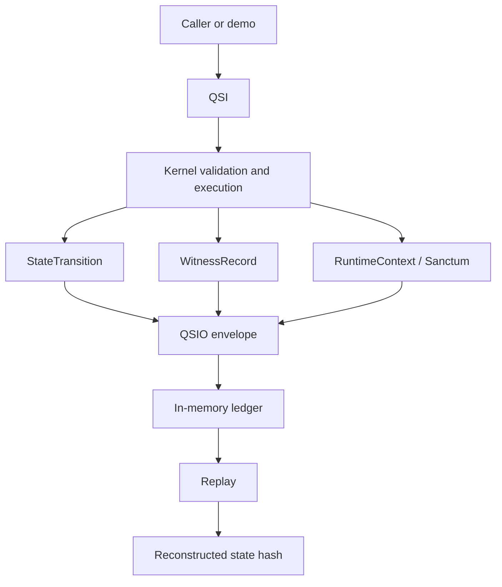

# QSIO Kernel

`qsio-kernel` is a compact reference implementation for representing bounded Quantum State Objects and recording their interactions as verifiable, content-addressed QSIO records.

## Why this repository exists

The kernel turns a small set of QSO concepts into executable contracts that can be tested:

1. an interaction request is explicit;
2. the pre-state is identified by hash;
3. a transition is proposed and either accepted or rejected;
4. witness metadata is attached;
5. the resulting record is content hashed and appended to a ledger; and
6. state can be reconstructed through replay.

The repository is deliberately local and deterministic. It is intended to make semantics inspectable before any persistence, networking, model integration, or federation layer is considered.

## Current capabilities

| Capability | Current implementation |
| --- | --- |
| Genesis | Authorized in-process creation of a QSO |
| State mutation | Patch-based transitions over bounded state fields |
| Validation | Rejects unknown actors and forbidden external-operation keys |
| Evidence links | Input references carried into transitions and witnesses |
| Integrity | Domain-separated SHA-256 content hashes |
| Ledger | Ordered in-memory QSIO records with parent references |
| Lifecycle control | Quietus blocks ordinary interaction; resume is explicit |
| Replay | Reconstructs a QSO state from ledger history |
| Demonstration | Four role-bounded QSOs complete a deterministic interaction chain |

## Explicit non-capabilities

The kernel does not claim durable audit storage, signature-backed identity, independent witnesses, distributed agreement, production authorization, concurrency safety, network isolation enforcement, model inference, autonomous learning, or self-directed spawning.

## Architecture at a glance

## Read next

- [Architecture](architecture.md) explains components, trust boundaries, and runtime flow.
- [Design and invariants](design.md) defines lifecycle and integrity rules.
- [API guide](api.md) maps the public Python surface.
- [Developer onboarding](onboarding.md) covers setup, tests, and contribution workflow.
- [Security](security.md) separates implemented controls from future hardening.
- [Task chain](../taskchain.md), [release plan](../release.md), and [changelog](../changelog.md) record scope and readiness.

## Documentation policy

Documentation must describe verified repository behavior or mark material as proposed. A documentation change may clarify an interface or invariant, but it must not silently authorize new runtime capabilities.
