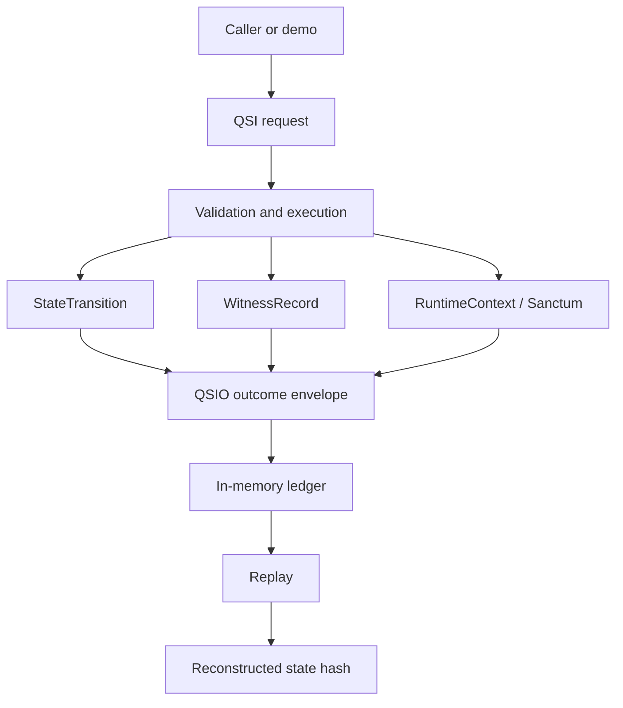

# QSIO Kernel

`qsio-kernel` is a compact Python reference implementation for representing bounded Quantum State Objects and recording their interactions as deterministic, content-addressed QSIO records.

It exists to make state, intent, transition evidence, lifecycle controls, and replay semantics executable and inspectable before those concepts are connected to persistence, external tools, distributed systems, or consequential authority.

## Current status

| Attribute | Current posture |
| --- | --- |
| Version | `0.1.0` experimental reference implementation |
| Runtime | Single local Python 3.12 process |
| State | In memory |
| Interaction model | Explicit QSI requests producing QSIO result records |
| Integrity | Domain-separated content hashing |
| Lifecycle | Genesis, active operation, Quietus, witnessed resume |
| Replay | Deterministic reconstruction from the in-memory ledger |
| External authority | None |
| Production readiness | Not claimed |

## Why this repository exists

The kernel turns a small set of QSO concepts into testable contracts:

1. an interaction request is explicit;
2. the pre-state is identified by hash;
3. a transition is proposed and either accepted or rejected;
4. witness metadata and evidence references are attached;
5. the resulting record is content hashed and appended to a ledger; and
6. state can be reconstructed through replay.

The implementation deliberately optimizes for clarity, boundedness, and deterministic evidence rather than throughput, distribution, autonomy, or integration breadth.

## Current capabilities

| Capability | Current implementation |
| --- | --- |
| Genesis | Authorized in-process creation of a QSO |
| State mutation | Patch-based transitions over bounded state fields |
| Validation | Rejects unknown actors and forbidden external-operation keys |
| Evidence links | Input references carried into transitions and witnesses |
| Integrity | Domain-separated SHA-256 content hashes |
| Ledger | Ordered in-memory QSIO records with parent references |
| Lifecycle control | Quietus blocks ordinary interaction; resume is explicit |
| Replay | Reconstructs QSO state from ledger history |
| Demonstration | Four role-bounded QSOs complete a deterministic chain |

## Explicit non-capabilities

The kernel does not currently provide:

- durable or replicated storage;
- signature-backed identity or independent witnesses;
- distributed agreement or concurrency safety;
- production authorization or credential management;
- network, browser, filesystem, subprocess, model, or payment integration;
- autonomous learning, task planning, repository modification, deployment, or self-directed spawning; or
- a complete A.L.I.S.T.A.I.R.E. control plane.

The validator's forbidden-operation keys are semantic controls inside this execution path, not an operating-system sandbox.

## Architecture at a glance

## A.L.I.S.T.A.I.R.E. relationship

Within the wider A.L.I.S.T.A.I.R.E. endeavor, this repository is presently a **candidate bounded semantic-kernel component**. It may provide deterministic execution and evidence primitives to an external orchestration and governance layer, but it does not own objectives, task authorization, credentials, repository actions, merges, releases, deployments, or emergency authority.

The portfolio still needs to decide whether this repository becomes the canonical low-level runtime, a conformance implementation, a migration source for another runtime, or an independent research prototype. See [A.L.I.S.T.A.I.R.E. integration](alistaire-integration.md) and [ADR 0002](adr/0002-alistaire-kernel-role.md).

## Documentation map

### Understand the system

- [Architecture](architecture.md) — components, runtime flow, trust boundaries, and topology.
- [A.L.I.S.T.A.I.R.E. integration](alistaire-integration.md) — portfolio role, contracts, authority boundary, and unresolved ownership.
- [Ontology](ontology.md) and [terminology](terminology.md) — core semantic vocabulary.

### Implement and verify

- [Design and invariants](design.md) — records, hashing, validation, lifecycle, and replay rules.
- [Lifecycle](lifecycle.md) — genesis, active state, Quietus, and resume.
- [Public API](api.md) — Python records and runtime entry points.
- [Developer onboarding](onboarding.md) — setup, tests, contribution workflow, and debugging.

### Operate and govern

- [Operations and recovery](operations.md) — local runbook, evidence capture, triage, and rollback.
- [Security](security.md) and [threat model](threat-model.md) — implemented controls and limitations.
- [Scope and release governance](governance.md) — alignment with the repository task chain, release plan, and changelog.
- [Architecture decisions](adr/0001-kernel-boundaries.md) — recorded and proposed decisions.

## Root governance records

The authoritative project-control records remain at the repository root:

- [`taskchain.md`](https://github.com/aevespers2/qsio-kernel/blob/main/taskchain.md)
- [`release.md`](https://github.com/aevespers2/qsio-kernel/blob/main/release.md)
- [`changelog.md`](https://github.com/aevespers2/qsio-kernel/blob/main/changelog.md)

These links resolve to `main` after accepted documentation is merged. Pull-request reviewers should inspect the submitted versions in the same exact head as the site build.

## Documentation policy

Documentation must describe behavior supported by repository evidence or label material as proposed. A documentation change may clarify an interface, boundary, invariant, or approval gate, but it must not silently authorize runtime capabilities or pass a release gate without evidence.