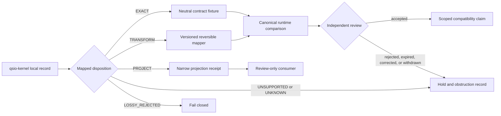

# Kernel-to-runtime crosswalk options

**Status:** `DOCUMENTED_NOT_SELECTED`

## Purpose

This guide defines decision-ready ways to relate the local `qsio-kernel` record model to a separately approved canonical runtime. It does not select a runtime, approve an adapter, establish semantic equivalence, issue a compatibility claim, or authorize execution.

The current kernel provides deterministic local QSO state, QSI requests, QSIO outcomes, transition hashes, witness metadata, logical ordering, an in-memory ledger, replay, Quietus, and local permission metadata. Those names and structures are repository-local until an independently governed profile maps them to exact external contracts.

## Decision boundary

A crosswalk is acceptable only when every mapped field has one explicit disposition:

- `EXACT` — identical meaning and canonical representation are independently demonstrated;
- `TRANSFORM` — a versioned, reversible transformation is specified and tested;
- `PROJECT` — a deliberately narrower view is emitted without implying equivalence;
- `UNSUPPORTED` — the route is intentionally unavailable;
- `UNKNOWN` — evidence is insufficient and the route remains blocked;
- `LOSSY_REJECTED` — information or authority would be collapsed, so processing fails closed.

Silence, matching field names, passing local tests, or a successful runtime execution cannot substitute for one of these dispositions.

## Candidate options

| Option | Description | Appropriate when | Required result | Principal risk |
|---|---|---|---|---|
| **A — Exact semantic profile** | Kernel and runtime consume the same neutral schema, canonical bytes, outcome vocabulary, lifecycle profile, and fixture set. | Independent evidence shows isomorphic semantics for a bounded profile. | Versioned compatibility claim scoped to exact sources and fixtures. | False equivalence if one field, clock, authority, or correction rule differs. |
| **B — Explicit projection profile** | A versioned mapper converts kernel records into a narrower runtime or review projection. | The kernel remains useful as a fixture evaluator but is not semantically identical to the runtime. | Projection receipt identifying omitted, transformed, unsupported, and privacy-restricted fields. | Downstream users may mistake a projection for canonical state. |
| **C — Unsupported route** | No kernel-to-runtime translation is accepted. Records remain local research evidence. | Ownership, canonical bytes, lifecycle, authority, or correction semantics are unresolved. | Fail-closed `UNSUPPORTED` disposition with no adapter execution. | Pressure to bypass the hold with ad hoc name-based mapping. |
| **D — Migration-source profile** | Selected concepts and fixtures migrate into another repository; this kernel becomes historical or test-only. | The portfolio chooses one canonical runtime and continued dual ownership creates more risk than value. | Preservation manifest, concept-by-concept disposition, deprecation plan, and rollback archive. | Loss of provenance or behavior if migration evidence is incomplete. |

No option is selected by this document. Option C is the safe default whenever the evidence required by A, B, or D is absent.

## Crosswalk surface

| Kernel surface | External question | Minimum evidence before `EXACT` or `TRANSFORM` | Safe unresolved disposition |
|---|---|---|---|
| `QSO.qso_id` | What namespace, generation, subject, retirement, and replacement rules apply? | Collision fixtures, lineage rules, registry owner, replacement and revocation tests. | `UNKNOWN` |
| `genome_version` and canon | Is declarative identity valid, current, and admitted? | Pinned genome projection, immutable policy reference, admission separation, revocation fixtures. | `UNSUPPORTED` |
| `QSI` | How are initiator, participants, evidence references, requested transition, and logical time interpreted? | Versioned schema, subject binding, replay domain, evidence policy, malformed vectors. | `LOSSY_REJECTED` |
| `QSIO.outcome` | Are accepted, rejected, partial, unknown, quarantined, corrected, revoked, and superseded states preserved? | Shared vocabulary and exhaustive positive/negative fixtures. | `UNKNOWN` |
| transition hashes | Are pre/post states encoded identically and privacy-safe? | Canonical bytes, null/omission rules, domain separation, redaction and disclosure review. | `UNSUPPORTED` |
| witness metadata | Is the witness local metadata or independent attestation? | Verifier identity, signature scope, trust class, downgrade and revocation tests. | `PROJECT` as untrusted metadata only |
| `PermissionSet` | Does local metadata correspond to an externally issued capability? | Issuer, scope, expiry, replay, revocation, device/workspace and expected-state binding. | `LOSSY_REJECTED` |
| logical time | How does local order relate to wall time, observation time, freshness, expiry, skew, and causality? | Clock-domain profile and conflicting-clock fixtures. | `PROJECT` as local order only |
| in-memory ledger | Is the record historical evidence, runtime state, or canonical portfolio disposition? | Durable identity, atomicity, correction, revocation, checkpoint and recovery profile. | `PROJECT` as local evidence only |
| Quietus | Is the object locally stopped, externally frozen, revoked, quarantined, retired, or recovering? | Lifecycle crosswalk and stop/recovery fixtures with independent authority. | `LOSSY_REJECTED` |

## Lifecycle crosswalk

Quietus is a local mutation stop. It must not be silently treated as any of the following:

- runtime admission freeze;
- capability revocation;
- security quarantine;
- compatibility-claim withdrawal;
- permanent retirement;
- emergency stop;
- recovery authorization.

A valid profile records each relationship independently and rejects automatic resume. A recovery route must identify the approved checkpoint, current contract generation, revoked authorities, queued and in-flight work disposition, and restored-state evidence.

## Composition graph



### Prose equivalent

A local kernel record first receives an explicit mapping disposition. Exact and transformed routes proceed through pinned neutral fixtures to a separately identified runtime comparison. A projection route may reach a review-only consumer but cannot become canonical state. Unsupported, unknown, and lossy routes stop and produce an obstruction record. Only an independent reviewer may issue a bounded compatibility claim, and later correction, expiry, revocation, or withdrawal returns the route to a held state.

## Required gluing witnesses

Before any option other than C is accepted, immutable fixtures must demonstrate:

1. **identity continuity** — subject, genome, contract, fixture, mapping, kernel, runtime, execution, receipt, and disposition identities remain distinct;
2. **byte continuity** — canonical or explicitly transformed bytes and hashes reproduce across independent implementations;
3. **state continuity** — pre-state, post-state, parent links, branches, partial outcomes, and replay do not diverge;
4. **authority continuity** — a local permission, witness, outcome, or hash cannot become an external capability or approval;
5. **temporal continuity** — logical order does not become freshness or expiry without a clock profile;
6. **correction continuity** — correction, supersession, revocation, redaction, claim withdrawal, and cache invalidation propagate without rewriting history;
7. **stop and recovery continuity** — Quietus, freeze, revocation, quarantine, retirement, emergency stop, and recovery remain distinct;
8. **consumer continuity** — Bridge, QSO-STUDIO, AionUi, Fabric, and Repository `1` preserve status and do not strengthen authority by display, transport, aggregation, or reconciliation.

Pairwise fixture agreement is insufficient when a third component can reinterpret identity, status, time, authority, or correction state.

## Review packet

A crosswalk proposal must include:

```text
Option and profile version:
Neutral contract owner and exact source:
Canonical runtime and exact source/configuration:
Kernel exact source:
Fixture-set identity and digest:
Mapping identity and digest:
Field-by-field dispositions:
Unsupported and lossy routes:
Canonical-byte or transformation evidence:
Outcome/reason and lifecycle evidence:
Clock and replay domains:
Privacy, retention, and disclosure review:
Correction, revocation, and withdrawal behavior:
Pairwise and triple-overlap results:
Independent reviewer and expiry:
Previous known-good profile:
Rollback and restoration evidence:
```

Missing fields keep the route at `UNKNOWN` or `UNSUPPORTED`.

## Rollback and withdrawal

A profile must be withdrawn when canonical bytes drift, an unsupported mapping is accepted, identity collisions appear, replay diverges, a correction or revocation fails to propagate, a local control is interpreted as external authority, or the named runtime/contract generation changes without revalidation.

Rollback preserves the failed profile, fixtures, evidence, and review decision; marks downstream claims and caches stale or withdrawn; restores the last independently verified profile or the unsupported route; and requires fresh exact-head evidence before reuse.

## FYSA-120 capability map

This work applies:

- **011-B / 011-E** — accessible architecture diagrams, prose equivalents, and cross-modal consistency;
- **012-A / 012-B / 012-D / 012-E** — information architecture, decision and API documentation, terminology control, documentation testing, and lifecycle synchronization;
- **013-A / 013-D / 013-E** — graph modeling, path analysis, contradiction detection, and provenance-aware contract-graph maintenance;
- **017-C / 017-D / 017-E** — lineage, version-substitution detection, audit packaging, correction, and supersession;
- **019-B / 019-C / 019-D** — plain-language, accessible state communication, uncertainty, and risk explanation;
- **031-A / 031-D / 031-E** — contract specification, hostile fixture design, regression prevention, and assurance maintenance;
- **040-A / 040-B / 040-D / 040-E** — system archaeology, migration dependency analysis, compatibility-layer design, rollback, and continuity assurance.

Proposed non-authoritative subdivision: **`040-N — Fail-closed semantic crosswalk and unsupported-route governance`**. It covers field-level mapping dispositions, explicit unsupported routes, lossy-mapping rejection, claim withdrawal, preservation-safe migration, and independently verified restoration.

## Scope discipline

This guide changes documentation only. It does not create a mapper, schema registry, network route, runtime adapter, capability, credential, signature, storage system, release, deployment, publication, or canonical-state authority.