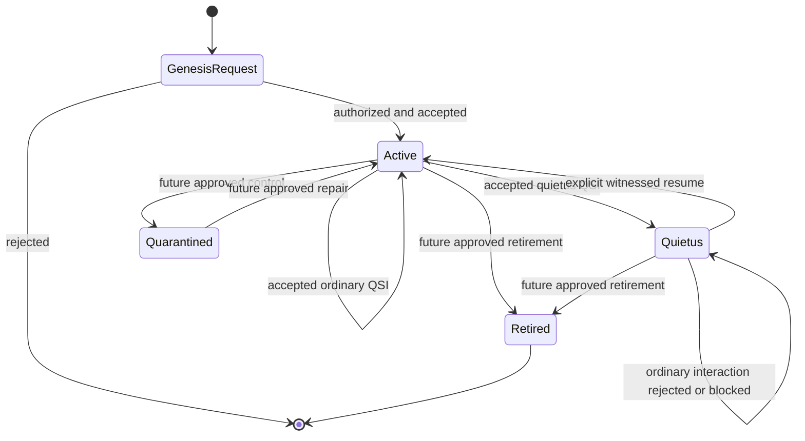

# Lifecycle

## Purpose

The lifecycle model limits when a QSO may be created, changed, paused, resumed, isolated, or retired. Version `0.1.0` meaningfully implements genesis, active operation, Quietus, and resume. Other lifecycle values are reserved by the state type but do not yet have complete runtime or operational semantics.

## Lifecycle states

| State | Meaning | Current support |
| --- | --- | --- |
| `genesis` | pre-active construction semantics | represented during state construction; accepted genesis registers the QSO as active |
| `active` | ordinary accepted transitions may update state | implemented |
| `quietus` | ordinary mutation is blocked | implemented |
| `quarantined` | isolated pending investigation or repair | type value only; operational flow not complete |
| `retired` | withdrawn from future operation | type value only; archival and finality rules not complete |

## State diagram

Dashed or future paths in conceptual diagrams must not be treated as implemented merely because the lifecycle value exists.

## Genesis

Genesis creates a QSO through an explicitly authorized QSI.

The current path requires:

- runtime genesis authorization;
- a unique `qso_id` within the registry;
- initial state values and state hash;
- genome version and canon constraints;
- permission data supplied by the context; and
- an accepted genesis transition and witness record.

The genesis transition uses `sha256:0` as its precondition hash. The accepted QSIO records the new QSO and appends it to the in-memory ledger.

Genesis authorization is an in-process flag. It is not identity proof, a signed capability, or portfolio approval.

## Active operation

An active QSO may receive ordinary QSI requests after the runtime verifies the initiator and participants and confirms that participants are not in Quietus.

For an accepted ordinary transition, the kernel:

1. reads the current pre-state hash;
2. derives a new `lumen` value from the request;
3. increments state version and logical time;
4. builds a transition with precondition and postcondition hashes;
5. attaches witness metadata;
6. records the new state; and
7. appends an accepted QSIO.

The prototype primarily updates visible `lumen` data. Broader field mutation requires explicit design and tests.

## Quietus

Quietus is the implemented pause control for a QSO.

Entry into Quietus:

- targets one QSO;
- records the current state hash as the precondition;
- increments state version and logical time;
- changes lifecycle to `quietus`;
- creates witness metadata; and
- appends an accepted QSIO.

While in Quietus, ordinary interaction is blocked by the runtime. Quietus should be treated as a semantic safety control, not process termination or credential revocation.

## Resume

Resume is an explicit lifecycle operation that returns a QSO from Quietus to active operation.

A safe resume contract should preserve:

- explicit intent;
- current-state precondition;
- witnessed authorization;
- accepted transition evidence;
- state-version and logical-time progression; and
- ledger continuity.

The current implementation provides a prototype resume path. Before production use, the portfolio must define who may authorize resume, what evidence is required, how revocation works, and whether human approval is mandatory.

## Rejection and exceptions

Invalid QSI validation can produce a rejected QSIO with reason codes. Some lifecycle and consistency defects may currently raise exceptions instead of returning a rejected record.

The repository must not claim a uniform failure contract until tests and API documentation establish which conditions:

- produce a rejected QSIO;
- quarantine the QSO;
- raise an exception;
- halt the runtime; or
- require external incident response.

Defining this boundary is part of verification hardening.

## Quarantine

`quarantined` is available as a lifecycle value but does not yet have an approved transition, evidence, repair, or release process.

A future quarantine design must define:

- automatic and manual triggers;
- authority to quarantine and release;
- whether all mutation is blocked;
- evidence preservation;
- capability revocation;
- inspection and repair workflow;
- timeout and escalation; and
- relation to portfolio emergency stop.

Until then, documentation should not imply that quarantine is operational.

## Retirement

`retired` is available as a lifecycle value but lacks complete finality and archival rules.

A future retirement design must answer:

- whether retirement is reversible;
- who may authorize it;
- how final state and ledger roots are preserved;
- how identifiers and genome references remain resolvable;
- which data may be retained or deleted;
- how dependent QSOs or QSIOs are handled; and
- how migration differs from retirement.

## Lifecycle evidence

Every accepted lifecycle change should be reconstructable from:

- the triggering QSI;
- participant pre-state hashes;
- the accepted transition;
- witness metadata;
- outcome and reason codes;
- parent QSIO hashes; and
- the resulting content hash.

Replay should reproduce the lifecycle state at each accepted boundary.

## Lifecycle safety invariants

1. A QSO identifier is unique within one runtime registry.
2. Genesis requires explicit runtime authorization.
3. Accepted non-genesis transitions reference the current pre-state hash.
4. State version and logical time do not move backward.
5. Quietus blocks ordinary mutation.
6. Resume is explicit and auditable.
7. Rejected interactions do not mutate QSO state.
8. Lifecycle changes remain represented by accepted QSIO transitions.
9. Quarantine and retirement are not claimed as operational until their flows are implemented and tested.
10. No QSO may grant itself external authority by changing lifecycle state.

## Portfolio control boundary

A.L.I.S.T.A.I.R.E.'s control plane must remain able to stop task issuance, revoke external capabilities, block repository or deployment actions, and require independent review regardless of a QSO's internal lifecycle value.

Quietus is one semantic layer. It is not a substitute for portfolio-wide emergency stop, credential revocation, process isolation, or incident authority.