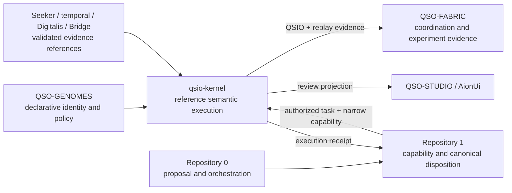

# Obstruction and gluing analysis

## Purpose

This document analyzes whether the local contracts implemented by `qsio-kernel` can compose consistently with the current A.L.I.S.T.A.I.R.E. repository portfolio.

The language of **sections**, **overlaps**, **gluing maps**, **witnesses**, and **obstructions** is used as an engineering discipline:

- a repository is treated as a local section with a bounded responsibility;
- a versioned contract is a proposed gluing map between sections;
- a fixture, receipt, replay, or exact-head artifact is a compatibility witness; and
- an obstruction is a concrete incompatibility that prevents a coherent global system.

This is not a claim that the repository currently performs a formal sheaf-cohomology or homology computation. A formal computation would require a declared site or cover, coefficient objects, restriction maps, cocycles, and reproducible algorithms that do not yet exist here.

## Current local section

`qsio-kernel` currently implements a Python 3.12, in-memory `0.1.0` reference model for:

- QSO state and lifecycle records;
- QSI interaction requests;
- QSIO accepted and rejected outcome records;
- deterministic canonical serialization and domain-separated hashing;
- state transitions, witnesses, parent references, and reason codes;
- genesis, active interaction, Quietus, and explicit resume;
- an ordered in-memory ledger and replay of final state hashes; and
- a bounded four-QSO demonstration.

It does not implement durable storage, independent signatures, capability issuance, external evidence retrieval, network transport, concurrency control, cross-repository canonical state, or production authorization.

## Candidate portfolio placement

The lowest-coupling working model is:

Under this candidate:

- Repository `0` prepares objectives and non-authoritative proposals;
- Repository `1` or an approved successor admits tasks, issues narrow capabilities, records revocations, and decides canonical disposition;
- QSO-GENOMES supplies declarative identity and policy references;
- `qsio-kernel` executes bounded local semantics and emits evidence;
- QSO-FABRIC coordinates multi-QSO experiments rather than redefining kernel semantics;
- evidence acquisition, temporal interpretation, domain interpretation, and transport remain external; and
- review surfaces display or annotate evidence without creating authority by interaction alone.

This placement is a recommendation for compatibility analysis, not an accepted portfolio decision.

## Material obstruction ledger

| ID | Obstruction | Conflicting local meanings | Failure if left unresolved | Required witness or decision |
| --- | --- | --- | --- | --- |
| O-01 | Canonical runtime identity | `qsio-kernel` and `QuantumStateObjects` both describe executable QSO lifecycle and evidence semantics | Two runtimes can produce records that look equivalent but are not mutually replayable | Select canonical runtime, conformance implementation, migration source, or independent prototype; publish immutable compatibility fixtures |
| O-02 | QSO/QSI/QSIO schema ownership | Kernel records, QSO-GENOMES mappings, QSO-FABRIC candidates, and generic QSIO proposals each imply schema authority | Field names, required values, hashing, and evolution can diverge silently | Name package and registry owner; version schemas and unsupported-version behavior |
| O-03 | Genome identity and admission | Kernel accepts `genome_version` as a value; QSO-GENOMES owns declarative identity; Repository `1` is the candidate admission authority | A syntactically valid genome reference may be mistaken for an admitted identity or capability | Genome-resolution profile plus Repository `1` admission receipt and negative fixtures |
| O-04 | Canon versus operational policy | Kernel canon strings constrain local requests; QSO-GENOMES policy and Repository `1` capabilities have different authority | Local canon text may be treated as globally enforceable authorization | Separate declarative canon, runtime validation, and operational capability contracts |
| O-05 | `PermissionSet` versus capability envelope | Kernel permission records are local data; Repository `1` contract describes scoped, expiring, revocable capabilities | A permission record may be mistaken for authorization to use tools, networks, repositories, or devices | Explicit adapter translating an independently issued capability into a local execution profile; fail-closed fixtures |
| O-06 | Witness strength | Kernel witnesses are optional in-process metadata; other portfolio documents discuss independent attestation and signed receipts | Consumers may overstate integrity, signer independence, or non-repudiation | Witness-strength vocabulary, verifier identity, signature scope, and downgrade rules |
| O-07 | Ledger versus canonical state | Kernel ledger is ordered and in memory; Repository `1` is the candidate canonical-state authority; Fabric may keep experiment ledgers | A successful local append may be treated as portfolio acceptance or durable consensus | Execution receipt and separate canonical-disposition receipt; restart and rejection fixtures |
| O-08 | Logical time and temporal authority | Kernel uses deterministic logical integers; temporal-invariants handles observation time; external evidence may have wall-clock timestamps | Replay order, freshness, expiry, and causal order can be conflated | Clock-domain identifiers, ordering rules, timestamp provenance, skew policy, and replay-domain tests |
| O-09 | Evidence-reference semantics | `input_refs` are opaque strings; Seeker, Digitalis, temporal-invariants, and Bridge define richer evidence boundaries | Wrong-subject, stale, revoked, private, or transformed evidence can be referenced without detectable meaning | Versioned evidence-reference profile with subject, integrity, classification, freshness, correction, and revocation fields |
| O-10 | Canonical serialization and hash scope | Kernel hashes Python-derived canonical content; portfolio format proposals include JSON, CBOR, packages, streams, and registries | Equivalent records can hash differently or incompatible records can share an apparent identity | Canonical byte-level encoding, domain separation, field omission rules, test vectors, and migration policy |
| O-11 | Outcome and reason-code mapping | Kernel has local accepted/rejected outcomes and reason codes; Bridge, Seeker, Repository `1`, and review surfaces use other result vocabularies | Rejection, unknown, partial, revoked, and corrected states can collapse into pass/fail | Shared four-state or richer mapping profile with unknown and partial semantics preserved |
| O-12 | Quietus, freeze, revocation, and emergency stop | Quietus blocks ordinary local mutation; Fabric and governance documents describe freezes; Repository `1` describes revocation | One subsystem can appear stopped while another continues accepting work | Portfolio lifecycle crosswalk and triple-overlap fixtures for stop, revocation propagation, resume, and bounded recovery |
| O-13 | Correction and replay | Kernel replay follows existing records; portfolio evidence can later be corrected, revoked, redacted, or superseded | Historical replay can reconstruct a state that is no longer authorized or publicly presentable | Append-only correction/supersession profile, cache invalidation, and replay-at-disposition semantics |
| O-14 | Privacy, retention, and redaction | Kernel records can carry evidence references and state values; portfolio repositories have different privacy and retention assumptions | Sensitive values may become permanently hashed, logged, published, or retained without policy | Data classification, prohibited fields, reference-only rules, retention, deletion, redaction, and hash-disclosure analysis |
| O-15 | Crash and partial-failure semantics | Current state and ledger are process-local; future persistence or adapters can fail between transition, append, receipt, and canonical disposition | State, ledger, and external receipts can disagree after interruption | Atomicity boundary, idempotency key, recovery journal, partial-failure fixtures, and explicit `UNKNOWN` state |
| O-16 | Parent links, concurrency, and branching | Parent hashes assume an ordered local ledger; Fabric may coordinate multiple actors and runtimes | Concurrent branches can be silently linearized, overwritten, or treated as one history | Branch, merge, conflict, expected-head, and unsupported-concurrency policy |
| O-17 | Review-interface authority | QSO-STUDIO and AionUi may display approvals, corrections, and recovery state | A click, annotation, or visible status could be mistaken for a signed authorization or canonical decision | Review-contract identity, authenticated approval receipt, accessibility, stale-view, and revocation fixtures |
| O-18 | Release and compatibility authority | `0.1.0` exists without an accepted portfolio role or `0.x` compatibility guarantee | Consumers may bind to experimental behavior and later prevent safe consolidation | Release class, supported contract set, deprecation window, migration map, and withdrawal owner |

## Pairwise gluing contracts

### G-01 — QSO-GENOMES to `qsio-kernel`

A genome-consumption profile must define:

- immutable genome identity and version;
- lineage and compatibility rules;
- declared canon and policy fields;
- canonicalization and digest verification;
- unsupported, revoked, superseded, and malformed behavior; and
- the distinction between declarative identity and operational admission.

The kernel must not infer that a valid genome is admitted merely because it can parse the reference.

### G-02 — Repository `0` to Repository `1`

The Portable Security Contract and general proposal route establish the working pattern:

`0:working → 0:proposal (local, non-authoritative) → versioned envelope → 1:quarantine`

`qsio-kernel` begins only after Repository `1` or another approved authority has admitted an executable task and issued a capability usable by a bounded adapter.

### G-03 — Repository `1` to `qsio-kernel`

An execution-admission profile must bind:

- task, actor, device or environment, and runtime identity;
- accepted genome and schema versions;
- exact input and evidence references;
- permitted transition classes and resource limits;
- expiry, replay domain, expected pre-state, and idempotency key;
- issuer, executor, verifier, revoker, and incident owner; and
- required receipt, rollback, and canonical-disposition behavior.

The kernel does not issue or broaden this capability.

### G-04 — Evidence pipeline to `qsio-kernel`

Evidence references should cross the Seeker → temporal interpretation → Digitalis or domain adapter → Bridge boundary before use where those stages apply. The kernel should receive immutable references and declared interpretation profiles, not silently retrieve or reinterpret source material.

### G-05 — `qsio-kernel` to QSO-FABRIC

The runtime-to-fabric profile must define whether Fabric receives:

- immutable QSIO records;
- projected interaction summaries;
- replay checkpoints;
- contradiction or uncertainty annotations; or
- experiment-local coordination events.

Fabric must not redefine canonical transition hashing or treat experiment aggregation as canonical acceptance.

### G-06 — `qsio-kernel` to Repository `1`

A result profile must keep distinct:

1. local execution outcome;
2. evidence verification outcome;
3. policy evaluation;
4. canonical disposition; and
5. later correction or revocation.

A successful QSIO is evidence that the local semantic path accepted a request, not proof that an external action, release, or governance decision is authorized.

### G-07 — `qsio-kernel` to QSO-STUDIO or AionUi

The review projection must preserve:

- source and schema identity;
- accepted versus proposed transitions;
- reason codes and `UNKNOWN` or partial states;
- witness-strength limitations;
- correction, supersession, and revocation status;
- freshness and expected-head identity; and
- the distinction between annotation, recommendation, approval, and canonical disposition.

### G-08 — `qsio-kernel` to persistence and recovery

Any future durable adapter must specify:

- atomic append and state-commit boundary;
- corruption detection and recovery;
- snapshots versus event replay;
- schema migration and unsupported records;
- privacy, retention, redaction, and deletion limitations;
- checkpoint identity and authoritative root; and
- rollback without rewriting accepted public history.

## Required triple-overlap witnesses

Pairwise agreement is insufficient when three local sections can assign different meanings to the same event. The following overlap witnesses are mandatory before portfolio adoption.

### T-01 — Genome → kernel → Fabric

Prove that an immutable genome fixture:

1. resolves to one admitted local identity;
2. produces the same canonical runtime inputs;
3. yields a deterministic QSIO; and
4. is consumed by Fabric without changing identity, hash, lifecycle, or policy meaning.

Negative cases must include revoked genomes, unsupported versions, lineage conflicts, and local policy downgrade.

### T-02 — Repository `0` → Repository `1` → kernel

Prove accepted, rejected, stale, replayed, expired, wrong-environment, expected-head mismatch, unsupported-schema, and revoked-capability cases. Repository `0` local proposal state must never be interpreted as Repository `1` admission.

### T-03 — Seeker → temporal interpretation → kernel

Prove that source identity, observation time, subject identity, integrity, transformation lineage, freshness, correction, revocation, privacy classification, and license obligations survive into the kernel reference without hidden retrieval or reinterpretation.

### T-04 — Kernel → Fabric → Repository `1`

Prove that Fabric coordination does not transform local execution evidence into canonical state. Partial experiments, contradictions, abandoned branches, and revoked results must remain distinguishable during Repository `1` reconciliation.

### T-05 — Kernel → Bridge → review interface

Prove that serialization, transport, redaction, reason-code mapping, correction, and stale-view handling preserve the kernel record’s supported meaning. A displayed approval control must produce a separate authenticated approval receipt rather than mutate evidence meaning.

### T-06 — Quietus → revocation → recovery

Prove that:

- local Quietus blocks ordinary transitions;
- external revocation prevents new admitted work;
- queued and in-flight work reach a declared state;
- evidence and volatile state are preserved;
- there is no automatic unlock; and
- bounded restart resumes from an approved checkpoint with old capabilities still invalid.

### T-07 — Format registry → canonical runtime → conformance kernel

If another repository becomes canonical, prove that one machine-readable fixture produces equivalent identity, accepted/rejected semantics, canonical bytes or declared mapped bytes, reason codes, lifecycle, and replay across the canonical runtime and this conformance implementation.

### T-08 — Correction → canonical disposition → replay

Prove that a corrected or revoked evidence reference changes current policy disposition without silently rewriting the original QSIO. Replay must state whether it reconstructs historical execution state, current authorized state, or both.

## Candidate resolution order

1. **Select the durable repository role.** The lowest-overlap candidate is a reference conformance implementation unless the portfolio explicitly assigns canonical kernel ownership here.
2. **Name contract owners.** Assign QSO/QSI/QSIO, genome profile, evidence-reference profile, capability profile, lifecycle crosswalk, reason codes, and persistence contracts.
3. **Freeze a fixture vocabulary.** Publish machine-readable positive and negative fixtures before adding adapters.
4. **Reconcile authority.** Bind Repository `0` proposals to Repository `1` admission and keep local execution distinct from canonical disposition.
5. **Prove triple overlaps.** Pairwise adapters are not sufficient for release.
6. **Approve privacy and recovery.** Define data classes, retention, correction, revocation, emergency stop, and rollback ownership.
7. **Only then consider implementation expansion.** Persistence, signatures, transport, federation, or external tools remain separately gated.

## Architectural clarification required

The portfolio must approve or revise:

- `qsio-kernel` as canonical semantic kernel, conformance implementation, migration source, or independent research prototype;
- canonical QSO/QSI/QSIO schema and package ownership;
- the boundary with QuantumStateObjects and QSO-FABRIC;
- genome admission and identity ownership;
- evidence-reference, temporal, reason-code, correction, privacy, and retention ownership;
- Repository `1` or another capability and canonical-disposition authority;
- Quietus, freeze, revocation, emergency-stop, recovery, and rollback ownership; and
- release, compatibility, publication, incident, and withdrawal authority.

Until these decisions and witnesses exist, the repository remains a bounded local reference implementation. No adapter, credential, capability, persistence service, network route, canonical-state authority, publication, release, or deployment is created by this analysis.
