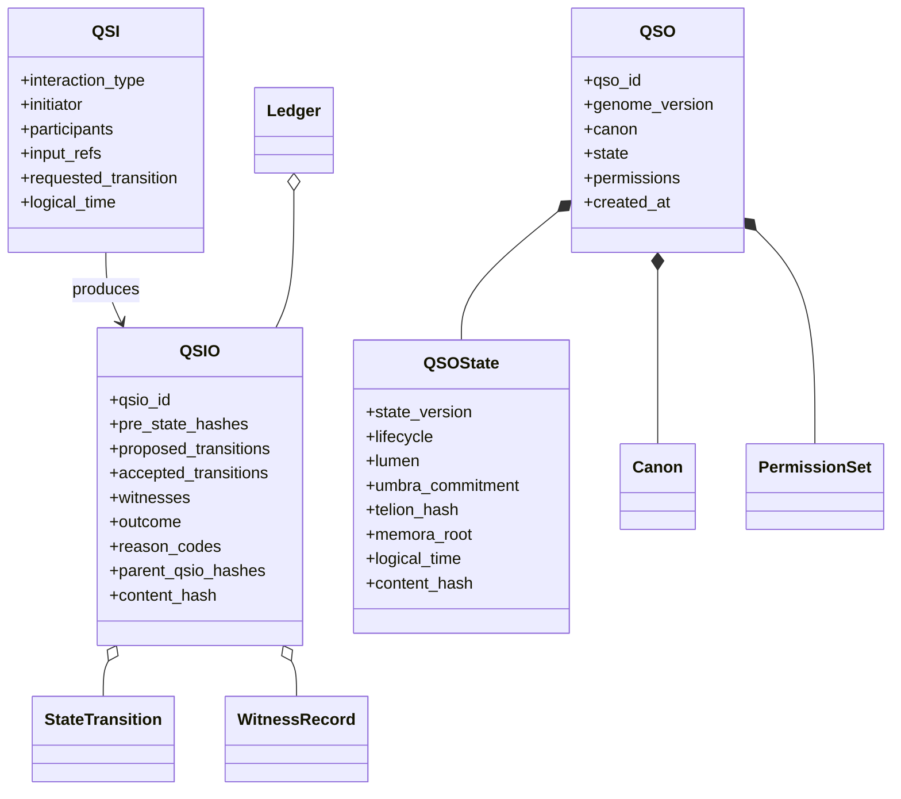
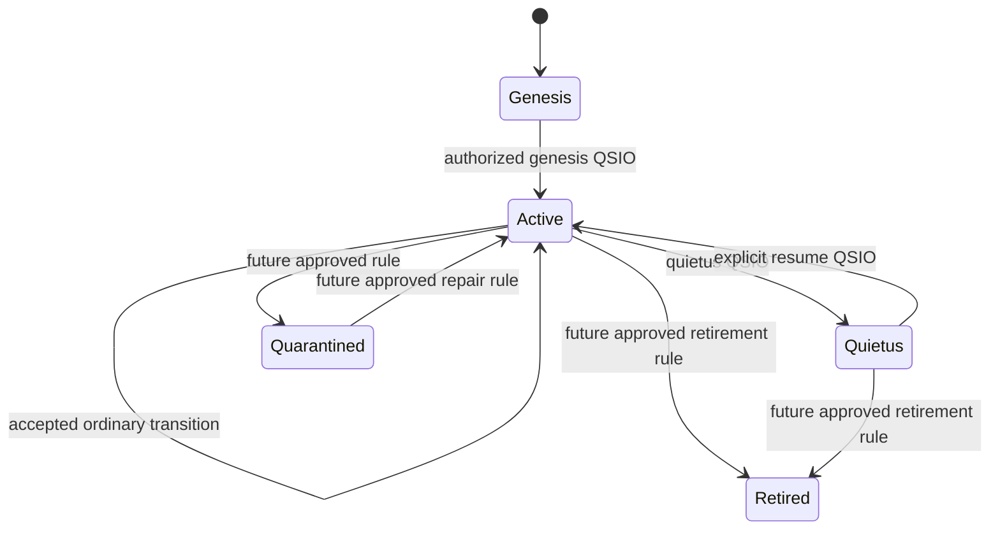
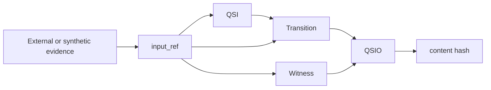

# Ontology

## Purpose

The `qsio-kernel` ontology defines a small executable vocabulary for bounded entities, interaction requests, state transitions, evidence records, lifecycle controls, and deterministic replay. It is intentionally narrower than the full A.L.I.S.T.A.I.R.E. conceptual framework.

The ontology's value comes from explicit fields and invariants rather than from terminology alone.

## Entity graph

## Primary classes

### QSO

A bounded entity whose identity and configuration remain separate from its mutable state. The current runtime registry maps `qso_id` to one QSO and records historical state versions separately.

### QSOState

A content-addressed snapshot of mutable semantic state. The content hash is computed from a versioned domain separator and the state payload.

### QSI

An interaction proposal. It identifies actors and desired change but carries no independent proof of identity or authority.

### QSIO

An outcome record that makes the interaction auditable. Accepted and rejected outcomes share the same record family, allowing rejection evidence to remain part of the ledger history.

### StateTransition

A proposed or accepted state delta linked to precondition and postcondition hashes. The separation between proposed and accepted transitions is an important epistemic and audit boundary.

### WitnessRecord

A verification observation attached to the interaction result. Current witnesses are created within the same process and therefore have limited trust strength.

## Supporting classes

### Canon

Declared semantic constraints associated with a QSO. A canon hash supports integrity of the declared set, while enforcement remains limited to implemented validation rules.

### PermissionSet

Capability-related data available to the runtime. It should be viewed as a prototype policy input, not a complete access-control system.

### Telion

Purpose or objective semantics referenced by hash from QSO state.

### Memora

Memory semantics represented by entries and a root reference. Durable storage is outside the current ontology implementation.

### Nexis

Relations among semantic objects or evidence references. Nexis describes connection meaning; it is not transport or networking.

### Ledger

An ordered in-memory container for QSIO records. It preserves sequence and parent references during one process execution.

## Relations and cardinality

| Relation | Meaning | Current constraint |
| --- | --- | --- |
| QSO has state | current mutable semantic snapshot | one current state per registered QSO |
| QSO has canon | declared constraints | one canon object per QSO |
| QSI names participants | intended interaction scope | one or more identifiers depending on operation |
| QSI produces QSIO | request-to-outcome relation | one outcome per execution call |
| QSIO contains transitions | proposed and accepted change evidence | zero or more |
| QSIO contains witnesses | verification metadata | zero or more |
| QSIO references parents | ledger ancestry | current implementation links recent prior record |
| Ledger orders QSIOs | process-local history | append order |
| Replay consumes QSIOs | reconstructs state | ordered through optional boundary |

## State model

Only the genesis, active, Quietus, and resume paths are meaningfully exercised by the current prototype. Quarantined and retired are available state values without complete operational semantics.

## Evidence model

Evidence is represented through references rather than embedded external content.

The kernel does not retrieve, authenticate, classify, retain, or independently verify referenced evidence. Those responsibilities require external ownership.

## Integrity model

Content-addressed records use domain-separated hashing. A domain separator distinguishes record families or versions so that equivalent-looking payloads from different semantic domains are not intentionally treated as the same object.

Integrity claims are limited to deterministic payload representation and hash comparison within the implemented environment. They do not establish signer identity, trusted time, non-repudiation, or distributed agreement.

## Ontological boundaries

The implementation models:

- bounded semantic entities;
- explicit interaction intent;
- deterministic transition evidence;
- lifecycle state;
- process-local history; and
- replayable state reconstruction.

It does not model or establish:

- consciousness, sentience, personhood, or legal agency;
- external identity or credential ownership;
- physical quantum state;
- distributed consensus;
- autonomous repository or deployment authority;
- complete memory, learning, or cognition; or
- the full A.L.I.S.T.A.I.R.E. architecture.

## Evolution rule

An ontology change is contract significant when it adds or changes a record, field, lifecycle value, relation, hash domain, validation rule, or replay interpretation. Such a change requires:

1. schema and compatibility analysis;
2. fixtures and tests;
3. migration or rejection behavior;
4. architecture and API updates;
5. release and changelog updates; and
6. approval from the canonical contract owner once that owner is designated.