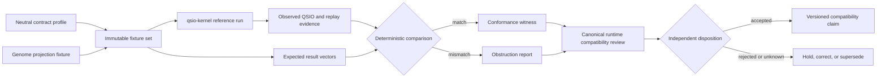

# Runtime Conformance Boundary Profile

## Purpose

This profile defines the lowest-overlap candidate role for `qsio-kernel`: a **small, deterministic reference-conformance implementation** used to test shared QSO/QSI/QSIO semantics without becoming A.L.I.S.T.A.I.R.E.'s broad runtime, capability authority, device-control layer, transport service, review interface, or canonical-state owner.

The profile is documentation-only. It does not approve the role, change runtime behavior, or establish a canonical contract package.

## Candidate ownership split

| Concern | Candidate owner | `qsio-kernel` boundary |
|---|---|---|
| Neutral record schemas, canonical bytes, digests, namespaces, profile registry, compatibility | Unassigned neutral contract owner | Consumes pinned fixtures; does not define portfolio authority by implementation alone |
| Declarative identity, genome lineage, immutable policy references | QSO-GENOMES | Resolves only fixture-bound genome projections |
| Admission, capability validation, bounded runtime execution, resulting-state evidence | QuantumStateObjects or another approved canonical runtime | Does not replace admission or execute consequential external work |
| Multi-QSO experiment coordination and branch aggregation | QSO-FABRIC | Emits conformance evidence only; does not own experiment disposition |
| Capability issuance, revocation, canonical disposition, recovery checkpoints | Repository `1` or approved successor | Never issues capabilities or writes canonical state |
| Planning and proposal preparation | Repository `0` | Receives no authority from proposals |
| Evidence acquisition, interpretation, transport, and review | Seeker / temporal profile / Digitalis / Bridge / QSO-STUDIO / AionUi | Uses fixture references only; does not retrieve, reinterpret, transport, or approve evidence |
| Reference semantic execution | `qsio-kernel` | Deterministic local fixture evaluation, replay, and comparison |

## Identity separation

The following identities must remain distinct:

- `contract_profile_id` — immutable semantic contract and compatibility profile;
- `fixture_set_id` — exact positive, negative, malformed, lifecycle, and replay vectors;
- `genome_projection_id` — fixture-bound declarative identity and policy projection;
- `runtime_admission_id` — canonical runtime's decision to admit a bounded task;
- `capability_id` — independently issued authority for a specific execution;
- `conformance_run_id` — one local reference evaluation against exact kernel source and fixtures;
- `qsi_id` — requested semantic interaction within the fixture;
- `qsio_id` — local content-addressed result produced by the reference kernel;
- `runtime_execution_id` — actual canonical-runtime execution attempt, if separately authorized;
- `execution_receipt_id` — evidence from that actual execution;
- `canonical_disposition_id` — Repository `1` or successor reconciliation decision;
- `correction_id`, `revocation_id`, and `recovery_checkpoint_id` — later authority records.

A matching `qsio_id` and expected fixture result demonstrates semantic agreement for the tested vector. It does not prove that a runtime admission, capability, execution receipt, or canonical disposition exists.

## Conformance flow

The conformance run is local and side-effect-free outside its declared evidence output. No network, device, repository, credential, payment, deployment, or external-tool authority is inferred.

## Admission versus conformance

A canonical runtime may use a passing conformance witness as one input to admission policy, but the witness cannot replace:

- device and workspace identity validation;
- exact runtime source and configuration binding;
- capability scope, expiry, revocation, and replay checks;
- privacy, retention, consent, and evidence policy;
- resource limits and failure containment;
- expected pre-state and rollback readiness;
- human approval where required.

Conversely, a successful canonical-runtime execution does not prove conformance unless the same immutable contract and fixture mappings reproduce at the pinned reference-kernel source.

## Contract mapping

The neutral profile must define an explicit mapping rather than assuming that similarly named fields are equivalent.

| Neutral concept | Current kernel concept | Required clarification |
|---|---|---|
| semantic subject | `QSO.id` | namespace, generation, retirement, replacement, and collision rules |
| declarative identity | genome and canon references | authoritative resolver, lineage, revocation, and projection rules |
| interaction request | `QSI` | version, subject binding, evidence references, clock domain, and replay domain |
| accepted/rejected result | `QSIO.outcome` and reason | shared outcome vocabulary, `UNKNOWN`, partial, revoked, corrected, and superseded states |
| pre/post state | QSO state and transition hashes | canonical bytes, omitted/null rules, redaction, and disclosure policy |
| witness | witness metadata | independent-attestation classes, signer/verifier identity, and trust strength |
| lifecycle stop | Quietus | crosswalk to freeze, quarantine, revocation, emergency stop, and recovery |
| local history | in-memory ledger and parent hashes | distinction from canonical disposition, durable evidence, and recovery checkpoints |
| logical ordering | deterministic logical time | observation time, wall time, freshness, expiry, skew, and causal ordering |

An unapproved or lossy mapping is a failed conformance condition, not a warning that may be ignored.

## Required fixture classes

### Positive

- genesis and ordinary transition;
- multi-participant deterministic interaction;
- Quietus and explicit local resume;
- replay to the expected final state;
- supported genome and contract versions;
- explicit mapping to the canonical runtime's accepted result.

### Negative and adversarial

- malformed, unsupported, or downgraded contract version;
- wrong subject, genome, runtime, fixture, or expected head;
- missing or ambiguous field mapping;
- stale, replayed, revoked, corrected, or superseded reference;
- invalid pre-state, broken parent link, corrupted digest, or branch divergence;
- witness downgrade or false independent-attestation claim;
- forbidden external-capability request;
- Quietus bypass or automatic resume;
- partial, unknown, or unsupported state collapsed into accepted;
- canonical-runtime success with reference-kernel mismatch;
- reference-kernel match without runtime admission or capability.

## Triple-overlap witnesses

Pairwise equivalence is insufficient. The following triples must reproduce at immutable versions:

1. **QSO-GENOMES → neutral contract → `qsio-kernel`** — genome projection and semantic validation agree.
2. **Neutral contract → `qsio-kernel` → QuantumStateObjects** — expected bytes, outcomes, lifecycle, and replay mappings agree.
3. **Repository `0` → Repository `1` → QuantumStateObjects** — proposal, capability, and runtime admission remain independent from conformance.
4. **`qsio-kernel` → QuantumStateObjects → QSO-FABRIC** — local semantic result, runtime execution evidence, and experiment aggregation do not collapse.
5. **Seeker/temporal/Digitalis → QuantumStateObjects → `qsio-kernel`** — source evidence and interpretations are referenced consistently without local retrieval.
6. **`qsio-kernel` → Bridge → QSO-STUDIO/AionUi** — display and transport preserve identity, status, mapping, correction, and revocation.
7. **Quietus → Repository `1` revocation → recovery checkpoint** — local lifecycle and external authority stops remain distinct and composable.
8. **Correction → canonical disposition → replay** — historical replay and current authorized-state reconstruction remain distinct.

## Material obstructions

This profile records the following unresolved obstructions:

1. no neutral owner for schemas, canonical bytes, hashes, namespaces, profiles, and fixtures;
2. overlapping runtime claims between `qsio-kernel` and QuantumStateObjects;
3. QSO-GENOMES canon/policy projections are not mapped to kernel validation by an approved profile;
4. similarly named QSO/QSI/QSIO fields may not be semantically equivalent across repositories;
5. current witness metadata is not independent attestation;
6. local `PermissionSet` values are not Repository `1` capabilities;
7. Quietus is not freeze, revocation, quarantine, emergency stop, or recovery;
8. deterministic logical time is not freshness, expiry, or verified observation time;
9. local in-memory history is not canonical portfolio state;
10. correction, supersession, revocation, redaction, and cache invalidation lack shared semantics;
11. canonical hashes may expose sensitive correlation unless disclosure policy is approved;
12. no accepted compatibility-claim issuer, reviewer, expiry, withdrawal, or support owner exists.

## Release consequences

A future conformance-fixture release must:

- identify the canonical contract, runtime, fixture, and kernel source commits;
- include canonical or explicitly mapped bytes and digest vectors;
- publish positive, negative, malformed, lifecycle, replay, correction, and revocation fixtures;
- state supported and unsupported profile versions;
- distinguish semantic conformance from operational security and authority;
- expire or withdraw claims when any referenced contract or mapping is superseded;
- preserve failed and mismatched evidence;
- provide migration and rollback instructions.

No release may claim that `qsio-kernel` is the authoritative runtime solely because the implementation predates, inspired, or passes its own fixtures.

## Acceptance criteria

This candidate becomes adoptable only when:

- the portfolio selects the conformance role or another explicit role;
- ADR 0003 is accepted or superseded;
- neutral contract and registry ownership is approved;
- QuantumStateObjects or another runtime is identified as canonical for the relevant profile;
- machine-readable mappings and fixtures are committed at immutable versions;
- all required pairwise and triple-overlap witnesses pass;
- privacy, retention, correction, revocation, incident, release, and withdrawal owners are named;
- exact-head runtime and documentation evidence is retained.
