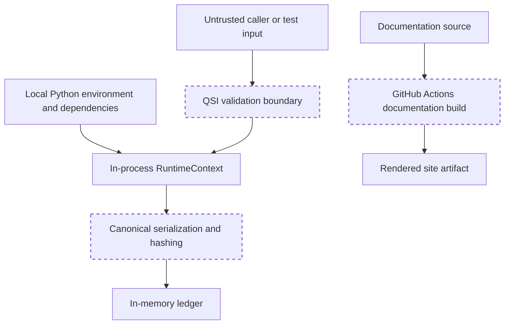

# Threat model

## Scope

This threat model covers the current `0.1.0` local Python reference kernel and its documentation build. It does not describe a hosted service, distributed runtime, production agent platform, or autonomous-development control plane.

The current trust boundary is one process with in-memory state. Callers, input references, requested transition data, local environment, dependencies, and generated artifacts should be treated as potentially untrusted.

## Security objectives

The prototype aims to preserve:

1. **explicit intent** — state change begins with a QSI;
2. **bounded mutation** — accepted changes are represented as state transitions;
3. **precondition integrity** — accepted non-genesis transitions bind to current state hashes;
4. **record integrity** — semantic records use domain-separated content hashes;
5. **auditability** — accepted and rejected outcomes remain represented by QSIOs where implemented;
6. **replayability** — ordered records can reconstruct QSO state;
7. **lifecycle control** — Quietus blocks ordinary mutation; and
8. **default denial of declared external-operation requests** — selected forbidden keys are rejected by semantic validation.

These objectives are prototype properties, not certification claims.

## Assets

| Asset | Why it matters |
| --- | --- |
| QSO identity and genome reference | binds state and semantics to an entity |
| Canon constraints | records declared limits |
| QSO state and content hash | represents current semantic state |
| QSI request | captures intent and evidence references |
| Transition preconditions and postconditions | prevent unnoticed stale mutation |
| QSIO record sequence | supports audit and replay |
| Witness metadata | records verification observations |
| Runtime permissions and limits | represent intended capability boundaries |
| Documentation and release records | constrain public claims and future scope |
| Workflow source identity and artifacts | establish which documentation source was built |

## Trust boundaries

The semantic validator, hash functions, and documentation workflow are review boundaries. They are not hardware roots of trust or independent security domains.

## Threats and present controls

| Threat | Present control | Residual risk |
| --- | --- | --- |
| Unknown initiator or participant | registry validation | no external identity proof |
| Request declares network, subprocess, spawn, or external I/O | forbidden-key rejection | alternate code paths are not OS sandboxed |
| Stale state transition | precondition-hash verification | coverage and exception behavior remain incomplete |
| Record tampering | content-hash verification | attacker controlling code can recompute hashes |
| Ledger reordering or truncation | ordered list and parent references | in-memory ledger lacks durable anchoring or consensus |
| Unverified witness on accepted QSIO | verification checks witness flag | witness is generated in process and not independent |
| Quietus bypass | runtime lifecycle checks and tests | requires broader adversarial and alternate-path coverage |
| Unbounded resource use | scheduler limits and spawn denial | complete CPU, memory, recursion, and wall-time isolation not established |
| Malicious input reference | reference is carried as data | no retrieval, classification, authentication, or sanitization policy |
| Dependency compromise | minimal dependencies | no recorded lockfile, provenance, or supply-chain review yet |
| Documentation built from wrong source | exact-head checkout and SHA assertion | workflow permissions and action dependencies still require review |
| Secret in generated site | boundary and secret-pattern checks | pattern checks are incomplete and cannot prove absence |
| Misleading autonomy or production claim | explicit non-capabilities and release gates | governance depends on review and enforcement outside code |

## Important non-controls

The following should not be represented as stronger security mechanisms than they are:

### Forbidden transition keys

Rejecting keys such as `network`, `external_io`, `subprocess`, and `spawn` blocks those declarations in the current QSI path. It does not prevent arbitrary Python code, dependencies, or future adapters from performing external actions.

### Canon

A content-hashed canon records declared constraints. It does not enforce every constraint automatically and is not a policy language with complete interpretation semantics.

### PermissionSet

Permission records represent intended capability data. The current execution path does not provide comprehensive issuance, authentication, revocation, expiry, delegation, or external enforcement.

### WitnessRecord

Witness records are in-process metadata. They are not cryptographic signatures, independent attestations, trusted timestamps, or proof of human review.

### Content hashes

Hashes support deterministic integrity comparison. They do not establish author identity, authorization, secrecy, non-repudiation, durable time, or distributed agreement.

### Quietus

Quietus blocks ordinary semantic mutation in the prototype. It does not terminate processes, revoke credentials, disable GitHub access, stop external tools, or replace a portfolio emergency stop.

## Abuse cases

### Self-authorized external action

A QSO or caller submits a QSI whose requested transition attempts to grant network, repository, credential, payment, or deployment authority.

**Required result:** reject the request or treat the fields as inert data. No record may create external authority merely by asserting it.

### Stale-state overwrite

A caller proposes a transition based on an earlier state while the QSO has already changed.

**Required result:** precondition mismatch prevents accepted mutation and produces auditable failure behavior.

### Witness laundering

A caller supplies or causes an in-process witness marked verified and then claims independent approval.

**Required result:** documentation and downstream consumers must preserve witness provenance and trust level; independent approval requires a separate verifier and policy.

### Ledger history rewriting

An operator changes earlier records, recomputes later hashes, and presents the result as original history.

**Current exposure:** possible because the ledger is local and lacks external anchoring. Durable evidence design must include append-only storage, roots, signatures or attestations, correction policy, and independent retention.

### Quietus escape

A QSO in Quietus is mutated through an alternate operation or direct state manipulation.

**Required result:** all supported mutation paths enforce lifecycle checks. Direct internal mutation remains a trusted-code concern and requires encapsulation hardening.

### Autonomous scope expansion

A documentation or code change claims that the kernel may plan tasks, modify repositories, merge changes, deploy, or self-modify because A.L.I.S.T.A.I.R.E. seeks autonomous development.

**Required result:** task-chain, ADR, release, capability, review, and rollback requirements remain mandatory. Mission does not equal authorization.

## Documentation supply-chain threats

The documentation workflow reduces, but does not eliminate, publication risk.

Controls implemented in the candidate include:

- pull-request-head SHA checkout;
- immutable source identity assertion;
- read-only repository permission;
- no persisted checkout credentials;
- pinned MkDocs version;
- strict site build;
- generated-site secret-pattern checks;
- SHA-256 file manifests; and
- retained rendered-site and evidence artifacts.

Further hardening should consider:

- pinning third-party actions to reviewed commit SHAs;
- dependency hash locking;
- action provenance and organization policy;
- artifact attestation;
- Pages deployment environment protection;
- accessibility and privacy review; and
- signed release or publication approval.

## Security gates before external integration

No networked, credentialed, or autonomous integration should proceed until the portfolio approves:

- canonical runtime and contract ownership;
- caller identity and authentication;
- capability issuance, delegation, expiry, and revocation;
- operating-system or container isolation;
- secret handling and credential custody;
- independent witness and signature policy;
- durable evidence, retention, correction, and recovery;
- input classification and privacy controls;
- resource quotas and denial-of-service containment;
- monitoring and incident response;
- emergency stop and rollback; and
- human or delegated approval for consequential actions.

## Reporting and response

The repository does not yet identify a security contact or formal response SLA. Until one is approved, security-sensitive findings should block release and be routed through the repository owner without publishing secrets, exploit details, private data, or live credentials.

Any unexpected external action, credential exposure, Quietus bypass, stale transition acceptance, hash instability, replay divergence, or sensitive artifact should trigger the stop and recovery process in [Operations and recovery](operations.md).